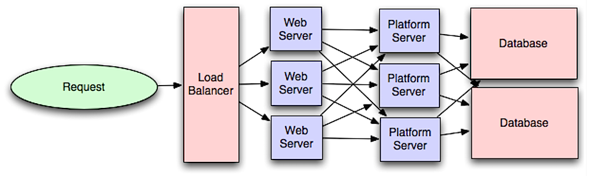

# System_Design
Resource - (https://roadmap.sh/system-design?fl=1)

## What is System Design?

System design is the process of defining the elements of a system, as well as their interactions and relationships, in order to satisfy a set of specified requirements.

It involves taking a problem statement, breaking it down into smaller components and designing each component to work together effectively to achieve the overall goal of the system. This process typically includes analyzing the current system (if any) and determining any deficiencies, creating a detailed plan for the new system, and testing the design to ensure that it meets the requirements. It is an iterative process that may involve multiple rounds of design, testing, and refinement.

In software engineering, system design is a phase in the software development process that focuses on the high-level design of a software system, including the architecture and components.

It is also one of the important aspects of the interview process for software engineers. Most of the companies have a dedicated system design interview round, where they ask the candidates to design a system for a given problem statement. The candidates are expected to come up with a detailed design of the system, including the architecture, components, and their interactions. They are also expected to discuss the trade-offs involved in their design and the alternatives that they considered.

## How To: System Design?

There are several steps that can be taken when approaching a system design:

* **Understand the problem**: Gather information about the problem you are trying to solve and the requirements of the system. Identify the users and their needs, as well as any constraints or limitations of the system.
* **Identify the scope of the system**: Define the boundaries of the system, including what the system will do and what it will not do.
* **Research and analyze existing systems**: Look at similar systems that have been built in the past and identify what worked well and what didn't. Use this information to inform your design decisions.
* **Create a high-level design**: Outline the main components of the system and how they will interact with each other. This can include a rough diagram of the system's architecture, or a flowchart outlining the process the system will follow.
* **Refine the design**: As you work on the details of the design, iterate and refine it until you have a complete and detailed design that meets all the requirements.
* **Document the design**: Create detailed documentation of your design for future reference and maintenance.
* **Continuously monitor and improve the system**: The system design is not a one-time process, it needs to be continuously monitored and improved to meet the changing requirements.

#### Additional Resources
[How to approach System Design?](https://github.com/donnemartin/system-design-primer#how-to-approach-a-system-design-interview-question)

## Performance vs Scalability

A service is scalable if it results in increased performance in a manner proportional to resources added. Generally, increasing performance means serving more units of work, but it can also be to handle larger units of work, such as when datasets grow.

Another way to look at performance vs scalability:

* If you have a performance problem, your system is slow for a single user.
* If you have a scalability problem, your system is fast for a single user but slow under heavy load.

#### Additional Resources
* [Scalability, Availability & Stability Patterns](https://www.slideshare.net/slideshow/scalability-availability-stability-patterns/4062682)
* [A Word on Scalability](https://www.allthingsdistributed.com/2006/03/a_word_on_scalability.html)
* [Performance vs Scalability](https://blog.professorbeekums.com/performance-vs-scalability/)

## Latency vs Throughput

Latency and throughput are two important measures of a system's performance. Latency refers to the amount of time it takes for a system to respond to a request. Throughput refers to the number of requests that a system can handle at the same time.

Generally, you should aim for maximal throughput with acceptable latency.

#### Additional Resources
* [System Design: Latency vs Throughput](https://cs.fyi/guide/latency-vs-throughput) 
* [Understanding Latency versus Throughput](https://community.cadence.com/cadence_blogs_8/b/fv/posts/understanding-latency-vs-throughput)

## Availability vs Consistency

Availability refers to the ability of a system to provide its services to clients even in the presence of failures. This is often measured in terms of the percentage of time that the system is up and running, also known as its uptime.

Consistency, on the other hand, refers to the property that all clients see the same data at the same time. This is important for maintaining the integrity of the data stored in the system.

In distributed systems, it is often a trade-off between availability and consistency. Systems that prioritize high availability may sacrifice consistency, while systems that prioritize consistency may sacrifice availability. Different distributed systems use different approaches to balance the trade-off between availability and consistency, such as using replication or consensus algorithms.

## CAP Theorem

According to CAP theorem, in a distributed system, you can only support two of the following guarantees:

* **Consistency** - Every read receives the most recent write or an error
* **Availability** - Every request receives a response, without guarantee that it contains the most recent version of the information
* **Partition Tolerance** - The system continues to operate despite arbitrary partitioning due to network failures

Networks aren't reliable, so you'll need to support partition tolerance. You'll need to make a software tradeoff between consistency and availability

### CP - consistency and partition tolerance
Waiting for a response from the partitioned node might result in a timeout error. CP is a good choice if your business needs require atomic reads and writes.

### AP - availability and partition tolerance
Responses return the most readily available version of the data available on any node, which might not be the latest. Writes might take some time to propagate when the partition is resolved.

AP is a good choice if the business needs to allow for [eventual consistency](https://github.com/donnemartin/system-design-primer#eventual-consistency) or when the system needs to continue working despite external errors.

#### Additional Resources
* [CAP FAQ](https://github.com/henryr/cap-faq)
* [CAP Theorem: Rivisited](https://robertgreiner.com/cap-theorem-revisited/)
* [A plain english introduction to CAP Theorem](http://ksat.me/a-plain-english-introduction-to-cap-theorem)

## Consistency Patterns

Consistency patterns refer to the ways in which data is stored and managed in a distributed system, and how that data is made available to users and applications. There are three main types of consistency patterns:

* Strong consistency - After an update is made to the data, it will be immediately visible to any subsequent read operations. The data is replicated in a synchronous manner, ensuring that all copies of the data are updated at the same time.
* Weak consistency - After an update is made to the data, it is not guaranteed that any subsequent read operation will immediately reflect the changes made. The read may or may not see the recent write.
* Eventual Consistency - Eventual consistency is a form of Weak Consistency. After an update is made to the data, it will be eventually visible to any subsequent read operations. The data is replicated in an asynchronous manner, ensuring that all copies of the data are eventually updated.

Each of these patterns has its own advantages and disadvantages, and the choice of which pattern to use will depend on the specific requirements of the application or system.

#### Additional Resources
* [Consistency Patterns in Distributed Systems](https://cs.fyi/guide/consistency-patterns-week-strong-eventual)

## Availability Patterns

Availability is measured as a percentage of uptime, and defines the proportion of time that a system is functional and working. Availability is affected by system errors, infrastructure problems, malicious attacks, and system load. Cloud applications typically provide users with a service level agreement (SLA), which means that applications must be designed and implemented to maximize availability.

#### Additional Resources
* [Availability Patterns](https://learn.microsoft.com/en-us/azure/well-architected/reliability/design-patterns#availability)

## Fail-Over

Failover is an availability pattern that is used to ensure that a system can continue to function in the event of a failure. It involves having a backup component or system that can take over in the event of a failure.

In a failover system, there is a primary component that is responsible for handling requests, and a secondary (or backup) component that is on standby. The primary component is monitored for failures, and if it fails, the secondary component is activated to take over its duties. This allows the system to continue functioning with minimal disruption.

Failover can be implemented in various ways, such as active-passive, active-active, and hot-standby.

### Active-Passive

With active-passive fail-over, heartbeats are sent between the active and the passive server on standby. If the heartbeat is interrupted, the passive server takes over the active's IP address and resumes service.

The length of downtime is determined by whether the passive server is already running in 'hot' standby or whether it needs to start up from 'cold' standby. Only the active server handles traffic.

Active-passive failover can also be referred to as master-slave failover.

### Active-Active

In active-active, both servers are managing traffic, spreading the load between them.

If the servers are public-facing, the DNS would need to know about the public IPs of both servers. If the servers are internal-facing, application logic would need to know about both servers.

Active-active failover can also be referred to as master-master failover.

### Disadvantage of failover
* Fail-over adds more hardware and additional complexity.
* There is a potential for loss of data if the active system fails before any newly written data can be replicated to the passive.

#### Additional Resources
* [Fail Over Pattern - High Availability](https://www.filecloud.com/blog/2015/12/architectural-patterns-for-high-availability/)

## Replication

Replication is an availability pattern that involves having multiple copies of the same data stored in different locations. In the event of a failure, the data can be retrieved from a different location. There are two main types of replication: Master-Master replication and Master-Slave replication.

* Master-Master replication: In this type of replication, multiple servers are configured as "masters," and each one can accept read and write operations. This allows for high availability and allows any of the servers to take over if one of them fails. However, this type of replication can lead to conflicts if multiple servers update the same data at the same time, so some conflict resolution mechanism is needed to handle this.

* Master-Slave replication: In this type of replication, one server is designated as the "master" and handles all write operations, while multiple "slave" servers handle read operations. If the master fails, one of the slaves can be promoted to take its place. This type of replication is simpler to set up and maintain compared to Master-Master replication.

#### Additional Resources
* [Replication: Availability Pattern](https://github.com/donnemartin/system-design-primer#replication)

## Availability in Numbers

Availability is often quantified by uptime (or downtime) as a percentage of time the service is available. Availability is generally measured in number of 9s--a service with 99.99% availability is described as having four 9s.

### 99.9% Availability - Three 9s:

| Duration          | Acceptable       |
| :---------------- | :-----------     | 
| Downtime per year |  8h 41min 38s    |
| Downtime per month|  43min 28 s      |    
| Downtime per week |  10min 4.8s      |
| Downtime per day  |  1min 26s        | 

### 99.99% Availability - Four 9s:

| Duration          | Acceptable     |
| :---------------- | :-----------   | 
| Downtime per year |  52min 9.8s    |
| Downtime per month|  4min 21s      |    
| Downtime per week |  1min 0.5s     |
| Downtime per day  |  8.6s          | 

### Availability in paralle vs in sequence

If a service consists of multiple components prone to failure, the service's overall availability depends on whether the components are in sequence or in parallel.

#### In sequence

Overall availability decreases when two components with availability < 100% are in sequence:

    Availability (Total) = Availability (Foo) * Availability (Bar)

If both Foo and Bar each had 99.9% availability, their total availability in sequence would be 99.8%.

#### In parallel

Overall availability increases when two components with availability < 100% are in parallel:

    Availability (Total) = 1 - (1 - Availability (Foo)) * (1 - Availability (Bar))

If both Foo and Bar each had 99.9% availability, their total availability in parallel would be 99.9999%.

#### Additional Resources
* [Availability in System Design](https://www.enjoyalgorithms.com/blog/availability-system-design-concept)

## Background Jobs

Background jobs in system design refer to tasks that are executed in the background, independently of the main execution flow of the system. These tasks are typically initiated by the system itself, rather than by a user or another external agent.

Background jobs can be used for a variety of purposes, such as:
* Performing maintenance tasks: such as cleaning up old data, generating reports, or backing up the database.
* Processing large volumes of data: such as data import, data export, or data transformation.
* Sending notifications or messages: such as sending email notifications or push notifications to users.
* Performing long-running computations: such as machine learning or data analysis.

### Event Driven

Event-driven invocation uses a trigger to start the background task. Examples of using event-driven triggers include:

* The UI or another job places a message in a queue. The message contains data about an action that has taken place, such as the user placing an order. The background task listens on this queue and detects the arrival of a new message. It reads the message and uses the data in it as the input to the background job. This pattern is known as asynchronous message-based communication.
* The UI or another job saves or updates a value in storage. The background task monitors the storage and detects changes. It reads the data and uses it as the input to the background job.
* The UI or another job makes a request to an endpoint, such as an HTTPS URI, or an API that is exposed as a web service. It passes the data that is required to complete the background task as part of the request. The endpoint or web service invokes the background task, which uses the data as its input.

### Schedule Driven

Schedule-driven invocation uses a timer to start the background task. Examples of using schedule-driven triggers include:

* A timer that is running locally within the application or as part of the application's operating system invokes a background task on a regular basis.
* A timer that is running in a different application, such as Azure Logic Apps, sends a request to an API or web service on a regular basis. The API or web service invokes the background task.
* A separate process or application starts a timer that causes the background task to be invoked once after a specified time delay, or at a specific time.

Typical examples of tasks that are suited to schedule-driven invocation include batch-processing routines (such as updating related-products lists for users based on their recent behavior), routine data processing tasks (such as updating indexes or generating accumulated results), data analysis for daily reports, data retention cleanup, and data consistency checks.

### Returning Results

Background jobs execute asynchronously in a separate process, or even in a separate location, from the UI or the process that invoked the background task. Ideally, background tasks are "fire and forget" operations, and their execution progress has no impact on the UI or the calling process. This means that the calling process does not wait for completion of the tasks. Therefore, it cannot automatically detect when the task ends.

#### Additional Resources
* [Background Jobs - Best Practices](https://learn.microsoft.com/en-us/azure/architecture/best-practices/background-jobs)

## Domain Name System (DNS)

A Domain Name System (DNS) translates a domain name such as www.example.com to an IP address.

DNS is hierarchical, with a few authoritative servers at the top level. Your router or ISP provides information about which DNS server(s) to contact when doing a lookup. Lower level DNS servers cache mappings, which could become stale due to DNS propagation delays. DNS results can also be cached by your browser or OS for a certain period of time, determined by the time to live (TTL).

* NS record (name server) - Specifies the DNS servers for your domain/subdomain.
* MX record (mail exchange) - Specifies the mail servers for accepting messages.
* A record (address) - Points a name to an IP address.
* CNAME (canonical) - Points a name to another name or CNAME (example.com to www.example.com) or to an A record.

Services such as CloudFlare and Route53 provide managed DNS services. Some DNS services can route traffic through various methods:

* Weighted Round Robin
  * Prevent traffic from going to servers under maintenance
  * Balance between varying cluster sizes
  * A/B testing
* Latency Based
* Geolocation Based

#### Additional Resources
* [Comparing Load Balancing Algorithms](https://www.jscape.com/blog/load-balancing-algorithms)
* [Choosing a routing policy](https://docs.aws.amazon.com/Route53/latest/DeveloperGuide/routing-policy.html#routing-policy-latency)
* [What is DNS? | How DNS works](https://www.cloudflare.com/learning/dns/what-is-dns/)

## Content Delivery Networks (CDN)

A content delivery network (CDN) is a globally distributed network of proxy servers, serving content from locations closer to the user. Generally, static files such as HTML/CSS/JS, photos, and videos are served from CDN, although some CDNs such as Amazon's CloudFront support dynamic content. The site's DNS resolution will tell clients which server to contact.

Serving content from CDNs can significantly improve performance in two ways:
* Users receive content from data centers close to them
* Your servers do not have to serve requests that the CDN fulfills

### Pull CDNs

Pull CDNs grab new content from your server when the first user requests the content. You leave the content on your server and rewrite URLs to point to the CDN. This results in a slower request until the content is cached on the CDN.

A time-to-live (TTL) determines how long content is cached. Pull CDNs minimize storage space on the CDN, but can create redundant traffic if files expire and are pulled before they have actually changed. Sites with heavy traffic work well with pull CDNs, as traffic is spread out more evenly with only recently-requested content remaining on the CDN.

### Push CDNs

Push CDNs receive new content whenever changes occur on your server. You take full responsibility for providing content, uploading directly to the CDN and rewriting URLs to point to the CDN. You can configure when content expires and when it is updated. Content is uploaded only when it is new or changed, minimizing traffic, but maximizing storage.

Sites with a small amount of traffic or sites with content that isn't often updated work well with push CDNs. Content is placed on the CDNs once, instead of being re-pulled at regular intervals.

#### Additional Resources
* [The Differences Between Push And Pull CDNs](https://www.travelblogadvice.com/technical/the-differences-between-push-and-pull-cdns/)
* [Brief about Content delivery network](https://en.wikipedia.org/wiki/Content_delivery_network)

## Load Balancers

Load balancers distribute incoming client requests to computing resources such as application servers and databases. In each case, the load balancer returns the response from the computing resource to the appropriate client.

Load balancers are effective at:
* Preventing requests from going to unhealthy servers
* Preventing overloading resources
* Helping to eliminate a single point of failure

Load balancers can be implemented with hardware (expensive) or with software such as HAProxy. Additional benefits include:
* **SSL termination** - Decrypt incoming requests and encrypt server responses so backend servers do not have to perform these potentially expensive operations
  * Removes the need to install X.509 certificates on each server
* **Session persistence** - Issue cookies and route a specific client's requests to same instance if the web apps do not keep track of sessions

### Disadvantages of load balancer
* The load balancer can become a performance bottleneck if it does not have enough resources or if it is not configured properly.
* Introducing a load balancer to help eliminate a single point of failure results in increased complexity.
* A single load balancer is a single point of failure, configuring multiple load balancers further increases complexity.

### Load Balancer vs Reverse Proxy
* Deploying a load balancer is useful when you have multiple servers. Often, load balancers route traffic to a set of servers serving the same function.
* Reverse proxies can be useful even with just one web server or application server, opening up the benefits described in the previous section.
* Solutions such as NGINX and HAProxy can support both layer 7 reverse proxying and load balancing

### Disadvantages of Reverse Proxy
* Introducing a reverse proxy results in increased complexity.
* A single reverse proxy is a single point of failure, configuring multiple reverse proxies (ie a failover) further increases complexity.

### Load Balancing Algorithms

A load balancer is a software or hardware device that keeps any one server from becoming overloaded. A load balancing algorithm is the logic that a load balancer uses to distribute network traffic between servers (an algorithm is a set of predefined rules).

There are two primary approaches to load balancing. Dynamic load balancing uses algorithms that take into account the current state of each server and distribute traffic accordingly. Static load balancing distributes traffic without making these adjustments. Some static algorithms send an equal amount of traffic to each server in a group, either in a specified order or at random.

### Layer 7 Load Balancing

Layer 7 load balancers look at the application layer to decide how to distribute requests. This can involve contents of the header, message, and cookies. Layer 7 load balancers terminate network traffic, reads the message, makes a load-balancing decision, then opens a connection to the selected server. For example, a layer 7 load balancer can direct video traffic to servers that host videos while directing more sensitive user billing traffic to security-hardened servers.

At the cost of flexibility, layer 4 load balancing requires less time and computing resources than Layer 7, although the performance impact can be minimal on modern commodity hardware.

### Layer 4 Load Balancing

Layer 4 load balancers look at info at the transport layer to decide how to distribute requests. Generally, this involves the source, destination IP addresses, and ports in the header, but not the contents of the packet. Layer 4 load balancers forward network packets to and from the upstream server, performing Network Address Translation (NAT).

### Horizontal Scaling

Load balancers can also help with horizontal scaling, improving performance and availability. Scaling out using commodity machines is more cost efficient and results in higher availability than scaling up a single server on more expensive hardware, called Vertical Scaling. It is also easier to hire for talent working on commodity hardware than it is for specialized enterprise systems.

### Disadvantages of horizontal scaling

* Scaling horizontally introduces complexity and involves cloning servers
  * Servers should be stateless: they should not contain any user-related data like sessions or profile pictures
  * Sessions can be stored in a centralized data store such as a database (SQL, NoSQL) or a persistent cache (Redis, Memcached)
* Downstream servers such as caches and databases need to handle more simultaneous connections as upstream servers scale out.

#### Additional Resources
* [Scalability for Dummies](https://cs.fyi/guide/scalability-for-dummies)
* [NGINX Architecture](https://blog.nginx.org/blog/inside-nginx-how-we-designed-for-performance-scale)
* [HAProxy Architecture Guide](https://www.haproxy.org/download/1.2/doc/architecture.txt)
* [What is a Reverse Proxy?](https://www.f5.com/glossary/reverse-proxy)
* [Types of load balancing algorithms](https://www.cloudflare.com/learning/performance/types-of-load-balancing-algorithms/)

## Application Layer

Separating out the web layer from the application layer (also known as platform layer) allows you to scale and configure both layers independently. Adding a new API results in adding application servers without necessarily adding additional web servers. The single responsibility principle advocates for small and autonomous services that work together. Small teams with small services can plan more aggressively for rapid growth.

### Disadvantages
* Adding an application layer with loosely coupled services requires a different approach from an architectural, operations, and process viewpoint (vs a monolithic system).
* Microservices can add complexity in terms of deployments and operations.

### Microservices

Related to the "Application Layer" discussion are microservices, which can be described as a suite of independently deployable, small, modular services. Each service runs a unique process and communicates through a well-defined, lightweight mechanism to serve a business goal. 1

Pinterest, for example, could have the following microservices: user profile, follower, feed, search, photo upload, etc.

#### Additional Resources
* [Introduction to architecting systems for scale.](https://lethain.com/introduction-to-architecting-systems-for-scale/#platform_layer) -- ***IMPORTANT***
* [Introduction to Microsevices](https://aws.amazon.com/microservices/)

## Databases

Picking the right database for a system is an important decision, as it can have a significant impact on the performance, scalability, and overall success of the system. Some of the key reasons why it's important to pick the right database include:

* **Performance:** Different databases have different performance characteristics, and choosing the wrong one can lead to poor performance and slow response times.
* **Scalability:** As the system grows and the volume of data increases, the database needs to be able to scale accordingly. Some databases are better suited for handling large amounts of data than others.
* **Data Modeling:** Different databases have different data modeling capabilities and choosing the right one can help to keep the data consistent and organized.
* **Data Integrity:** Different databases have different capabilities for maintaining data integrity, such as enforcing constraints, and can have different levels of data security.
* **Support and maintenance:** Some databases have more active communities and better documentation, making it easier to find help and resources.

### SQL vs noSQL

SQL databases, such as MySQL and PostgreSQL, are best suited for structured, relational data and use a fixed schema. They provide robust ACID (Atomicity, Consistency, Isolation, Durability) transactions and support complex queries and joins.

NoSQL databases, such as MongoDB and Cassandra, are best suited for unstructured, non-relational data and use a flexible schema. They provide high scalability and performance for large amounts of data and are often used in big data and real-time web applications.

The choice between SQL and NoSQL depends on the specific use case and requirements of the project. If you need to store and query structured data with complex relationships, an SQL database is likely a better choice. If you need to store and query large amounts of unstructured data with high scalability and performance, a NoSQL database may be a better choice.

### Relational Database Management System (RDBMS)

#### Replication
Replication is the process of copying data from one database to another. Replication is used to increase availability and scalability of databases. There are two types of replication: master-slave and master-master.

* **Master-slave Replication:** The master serves reads and writes, replicating writes to one or more slaves, which serve only reads. Slaves can also replicate to additional slaves in a tree-like fashion. If the master goes offline, the system can continue to operate in read-only mode until a slave is promoted to a master or a new master is provisioned.

* **Master-master Replication:** Both masters serve reads and writes and coordinate with each other on writes. If either master goes down, the system can continue to operate with both reads and writes.

#### Sharding
Sharding distributes data across different databases such that each database can only manage a subset of the data. Taking a users database as an example, as the number of users increases, more shards are added to the cluster.

Similar to the advantages of federation, sharding results in less read and write traffic, less replication, and more cache hits. Index size is also reduced, which generally improves performance with faster queries. If one shard goes down, the other shards are still operational, although you'll want to add some form of replication to avoid data loss. Like federation, there is no single central master serializing writes, allowing you to write in parallel with increased throughput.

#### Federation
Federation (or functional partitioning) splits up databases by function. For example, instead of a single, monolithic database, you could have three databases: forums, users, and products, resulting in less read and write traffic to each database and therefore less replication lag. Smaller databases result in more data that can fit in memory, which in turn results in more cache hits due to improved cache locality. With no single central master serializing writes you can write in parallel, increasing throughput.

#### Denormalization
Denormalization attempts to improve read performance at the expense of some write performance. Redundant copies of the data are written in multiple tables to avoid expensive joins. Some RDBMS such as PostgreSQL and Oracle support materialized views which handle the work of storing redundant information and keeping redundant copies consistent.

Once data becomes distributed with techniques such as federation and sharding, managing joins across data centers further increases complexity. Denormalization might circumvent the need for such complex joins.

#### SQL Tuning
SQL tuning is the attempt to diagnose and repair SQL statements that fail to meet a performance standard. It's important to benchmark and profile to simulate and uncover bottlenecks.

* Benchmark - Simulate high-load situations with tools such as ab.
* Profile - Enable tools such as the slow query log to help track performance issues.

### NoSQL

#### Key-Value Store
A key-value store generally allows for O(1) reads and writes and is often backed by memory or SSD. Data stores can maintain keys in lexicographic order, allowing efficient retrieval of key ranges. Key-value stores can allow for storing of metadata with a value.

Key-value stores provide high performance and are often used for simple data models or for rapidly-changing data, such as an in-memory cache layer. Since they offer only a limited set of operations, complexity is shifted to the application layer if additional operations are needed.

#### Document Store
document store is centered around documents (XML, JSON, binary, etc), where a document stores all information for a given object. Document stores provide APIs or a query language to query based on the internal structure of the document itself. Note, many key-value stores include features for working with a value's metadata, blurring the lines between these two storage types.

Based on the underlying implementation, documents are organized by collections, tags, metadata, or directories. Although documents can be organized or grouped together, documents may have fields that are completely different from each other.

#### Wide Column Store
A wide column store's basic unit of data is a column (name/value pair). A column can be grouped in column families (analogous to a SQL table). Super column families further group column families. You can access each column independently with a row key, and columns with the same row key form a row. Each value contains a timestamp for versioning and for conflict resolution.

Google introduced Bigtable as the first wide column store, which influenced the open-source HBase often-used in the Hadoop ecosystem, and Cassandra from Facebook. Stores such as BigTable, HBase, and Cassandra maintain keys in lexicographic order, allowing efficient retrieval of selective key ranges.

#### Graph 
In a graph database, each node is a record and each arc is a relationship between two nodes. Graph databases are optimized to represent complex relationships with many foreign keys or many-to-many relationships.

Graphs databases offer high performance for data models with complex relationships, such as a social network. They are relatively new and are not yet widely-used; it might be more difficult to find development tools and resources. Many graphs can only be accessed with REST APIs.

#### Additional Resources
* [Scaling up to your first 10 million users](https://www.youtube.com/watch?v=kKjm4ehYiMs) -- ***Video***
* [SQL vs noSQL: The Differences](https://www.sitepoint.com/sql-vs-nosql-differences/)
* [SQL vs noSQL Databases: What's the difference](https://www.ibm.com/think/topics/sql-vs-nosql)
* [noSQL vs SQL Databases](https://www.mongodb.com/resources/basics/databases/nosql-explained/nosql-vs-sql)
* Shrading
  * [The Coming of the Shard](https://highscalability.com/an-unorthodox-approach-to-database-design-the-coming-of-the/)
* SQL Tuning
  * [Introduction to SQL Tuning](https://docs.oracle.com/en/database/oracle/oracle-database/23/tgsql/introduction-to-sql-tuning.html)
* [Introduction to NoSQL](https://www.youtube.com/watch?v=qI_g07C_Q5I) -- ***Video***

## Caching

Caching is the process of storing frequently accessed data in a temporary storage location, called a cache, in order to quickly retrieve it without the need to query the original data source. This can improve the performance of an application by reducing the number of times a data source must be accessed.

There are several caching strategies:
* **Refresh Ahead:** You can configure the cache to automatically refresh any recently accessed cache entry prior to its expiration. Refresh-ahead can result in reduced latency vs read-through if the cache can accurately predict which items are likely to be needed in the future.
  * **Disadvantages:**
    * Not accurately predicting which items are likely to be needed in the future can result in reduced performance than without refresh-ahead
* **Write-Behind:** Data is written to the cache first and then asynchronously to the database improving write performance. This allows write operations to be faster, but it can lead to data inconsistencies if the cache is not properly managed.
  * **Dsiadvantages:**
    * There could be data loss if the cache goes down prior to its contents hitting the data store.
    * It is more complex to implement write-behind than it is to implement cache-aside or write-through.
* **Write-through:** Data is written to both the cache and the database at the same time. When data is updated, it is written to the cache and the database simultaneously. This ensures that the cache always contains up-to-date data, but it can slow down write operations.
  * **Disadvantages:** 
    * When a new node is created due to failure or scaling, the new node will not cache entries until the entry is updated in the database. Cache-aside in conjunction with write through can mitigate this issue.
    * Most data written might never be read, which can be minimized with a TTL.
* **Cache Aside:** The application is responsible for managing the cache. When data is requested, the application checks the cache first. If the data is not in the cache, it is retrieved from the database and stored in the cache for future use. This strategy is simple and flexible, but it requires careful management of the cache to ensure that it remains up-to-date.

Also, you can have the cache in several places, examples include:
* Client Caching
* CDN Caching
* Web Server Caching
* Database Caching
* Application Caching

#### Client Caching
Client-side caching refers to the practice of storing frequently accessed data on the client's device rather than the server. This type of caching can help improve the performance of an application by reducing the number of times the client needs to request data from the server.

One common example of client-side caching is web browsers caching frequently accessed web pages and resources. When a user visits a web page, the browser stores a copy of the page and its resources (such as images, stylesheets, and scripts) in the browser's cache. If the user visits the same page again, the browser can retrieve the cached version of the page and its resources instead of requesting them from the server, which can reduce the load time of the page.

Another example of client-side caching is application-level caching. Some applications, such as mobile apps, can cache data on the client's device to improve performance and reduce the amount of data that needs to be transferred over the network.

Client side caching has some advantages like reducing server load, faster page load times, and reducing network traffic. However, it also has some drawbacks like the potential for stale data if the client-side cache is not properly managed, or consuming memory or disk space on the client's device.

#### CDN Caching
A Content Delivery Network (CDN) is a distributed network of servers that are strategically placed in various locations around the world. The main purpose of a CDN is to serve content to end-users with high availability and high performance by caching frequently accessed content on servers that are closer to the end-users.

When a user requests content from a website that is using a CDN, the CDN will first check if the requested content is available in the cache of a nearby server. If the content is found in the cache, it is served to the user from the nearby server. If the content is not found in the cache, it is requested from the origin server (the original source of the content) and then cached on the nearby server for future requests.

CDN caching can significantly improve the performance and availability of a website by reducing the distance that data needs to travel, reducing the load on the origin server, and allowing for faster delivery of content to end-users.

#### Database Caching
Your database usually includes some level of caching in a default configuration, optimized for a generic use case. Tweaking these settings for specific usage patterns can further boost performance. it's like having a quick-access memory for frequently used data in applications. Here's a simplified explanation:

1. **Quick Access:** Imagine you're looking up information in a big library (the database). Instead of going to the library every time you need the same book (data), you keep a copy of it on your desk (cache).

2. **Faster Retrieval:** When you need that book again, you first check your desk (cache). If it's there, great! You get it right away without going to the library (database) again.

3. **Saving Time:** If the book isn't on your desk (cache miss), you go to the library (database) to get it. But you make sure to put a copy on your desk for next time, so you won't have to go to the library again if you need it soon.

4. **Different Types:** There are different ways to do this caching. You can cache the results of searches (like bookmarking), whole pieces of information (like keeping a paper copy), or even entire web pages (like saving a snapshot).

5. **Benefits:** By keeping frequently used data close by, you save time and reduce the strain on the library (database). It's like having your most-used books right at your fingertips, making your work faster and more efficient.

However, it's important to keep the cached data up to date. Otherwise, you might end up with outdated information, like using an old edition of a book instead of the latest one. So, managing this cache properly is key to keeping things running smoothly.

#### Application Caching
In-memory caches such as Memcached and Redis are key-value stores between your application and your data storage. Since the data is held in RAM, it is much faster than typical databases where data is stored on disk. RAM is more limited than disk, so cache invalidation algorithms such as least recently used (LRU) can help invalidate 'cold' entries and keep 'hot' data in RAM.

Redis has the following additional features:

* Persistence option
* Built-in data structures such as sorted sets and lists

Generally, you should try to avoid file-based caching, as it makes cloning and auto-scaling more difficult.

#### Additional Resources
* [Cache Strategies](https://medium.com/@mmoshikoo/cache-strategies-996e91c80303)
* [HTTP Caching](https://developer.mozilla.org/en-US/docs/Web/HTTP/Guides/Caching)

## Asynchronism
Asynchronous workflows help reduce request times for expensive operations that would otherwise be performed in-line. They can also help by doing time-consuming work in advance, such as periodic aggregation of data.

### Back Pressure
If queues start to grow significantly, the queue size can become larger than memory, resulting in cache misses, disk reads, and even slower performance. Back pressure can help by limiting the queue size, thereby maintaining a high throughput rate and good response times for jobs already in the queue. Once the queue fills up, clients get a server busy or HTTP 503 status code to try again later. Clients can retry the request at a later time, perhaps with exponential backoff.

### Task Queues
Tasks queues receive tasks and their related data, runs them, then delivers their results. They can support scheduling and can be used to run computationally-intensive jobs in the background.

Celery has support for scheduling and primarily has python support.

### Message Queues
Message queues receive, hold, and deliver messages. If an operation is too slow to perform inline, you can use a message queue with the following workflow:

* An application publishes a job to the queue, then notifies the user of job status
* A worker picks up the job from the queue, processes it, then signals the job is complete

The user is not blocked and the job is processed in the background. During this time, the client might optionally do a small amount of processing to make it seem like the task has completed. For example, if posting a tweet, the tweet could be instantly posted to your timeline, but it could take some time before your tweet is actually delivered to all of your followers.

* Redis is useful as a simple message broker but messages can be lost.
* RabbitMQ is popular but requires you to adapt to the 'AMQP' protocol and manage your own nodes.
* AWS SQS (Amazon Single Queue Service) is a host but can have high latency and has the posibility of messages being delivered twice.
* Apache Kafka is a distributed event store and stream-processing platform.

#### Additional Resources
* [Patterns for microservices - Sync vs Async](https://medium.com/inspiredbrilliance/patterns-for-microservices-e57a2d71ff9e)
* [Difference between Message Queue and Task Queue](https://www.quora.com/What-is-the-difference-between-a-message-queue-and-a-task-queue-Why-would-a-task-queue-require-a-message-broker-like-RabbitMQ-Redis-Celery-or-IronMQ-to-function)
* [RabbitMQ for beginners](https://www.cloudamqp.com/blog/part1-rabbitmq-for-beginners-what-is-rabbitmq.html)

## Idempotent Operations
Idempotent operations are operations that can be applied multiple times without changing the result beyond the initial application. In other words, if an operation is idempotent, it will have the same effect whether it is executed once or multiple times.

It is also important to understand the benefits of idempotent operations, especially when using message or task queues that do not guarantee exactly once processing. Many queueing systems guarantee at least once message delivery or processing. These systems are not completely synchronized, for instance, across geographic regions, which simplifies some aspects of their implementation or design. Designing the operations that a task queue executes to be idempotent allows one to use a queueing system that has accepted this design trade-off.

#### Additional Resources
* [What is an idempotent operation?](https://stackoverflow.com/questions/1077412/what-is-an-idempotent-operation)
* [Overview of Idempotent Operation](https://www.baeldung.com/cs/idempotent-operations)

## Communication
Network protocols are a key part of systems today, as no system can exist in isolation - they all need to communicate with each other. You should learn about the networking protocols such as HTTP, TCP, UDP. Also, learn about the architectural styles such as RPC, REST, GraphQL and gRPC.

### HTTP
HTTP is a method for encoding and transporting data between a client and a server. It is a request/response protocol: clients issue requests and servers issue responses with relevant content and completion status info about the request. HTTP is self-contained, allowing requests and responses to flow through many intermediate routers and servers that perform load balancing, caching, encryption, and compression.

A basic HTTP request consists of a verb (method) and a resource (endpoint). Below are common HTTP verbs:

Verb   | Description                   | Idempotent* | Safe | Cacheable                               |
-------|-------------------------------|-------------|------|-----------------------------------------|
GET    | Reads a resource              | Yes         | Yes  | Yes                                     |
POST   | Creates a resource or trigger | No          | No   | Yes if response contains freshness info |
PUT    | Creates or replace a resource | Yes         | No   | No                                      |
PATCH  | Partially updates a resource  | No          | No   | Yes if response contains freshness info |
DELETE | Deletes a resource            | Yes         | No   | No                                      |

HTTP is an application layer protocol relying on lower-level protocols such as TCP and UDP.

### TCP
TCP is a connection-oriented protocol over an IP network. Connection is established and terminated using a handshake. All packets sent are guaranteed to reach the destination in the original order and without corruption through:

* Sequence numbers and checksum field for each packet
* Acknowledgement packets and automatic retransmission

If the sender does not receive a correct response, it will resend the packets. If there are multiple timeouts, the connection is dropped. TCP also implements flow control and congestion control. These guarantees cause delays and generally result in less efficient transmission than UDP.

To ensure high throughput, web servers can keep a large number of TCP connections open, resulting in high memory usage. It can be expensive to have a large number of open connections between web server threads and say, a memcached server. Connection pooling can help in addition to switching to UDP where applicable.

TCP is useful for applications that require high reliability but are less time critical. Some examples include web servers, database info, SMTP, FTP, and SSH.

Use TCP over UDP when:

* You need all of the data to arrive intact
* You want to automatically make a best estimate use of the network.

### UDP
UDP is connectionless. Datagrams (analogous to packets) are guaranteed only at the datagram level. Datagrams might reach their destination out of order or not at all. UDP does not support congestion control. Without the guarantees that TCP support, UDP is generally more efficient.

UDP can broadcast, sending datagrams to all devices on the subnet. This is useful with DHCP because the client has not yet received an IP address, thus preventing a way for TCP to stream without the IP address.

UDP is less reliable but works well in real time use cases such as VoIP, video chat, streaming, and realtime multiplayer games.

### RPC
In an RPC, a client causes a procedure to execute on a different address space, usually a remote server. The procedure is coded as if it were a local procedure call, abstracting away the details of how to communicate with the server from the client program. Remote calls are usually slower and less reliable than local calls so it is helpful to distinguish RPC calls from local calls.

### gRPC
gRPC is a high-performance, open-source framework for building remote procedure call (RPC) APIs. It is based on the Protocol Buffers data serialization format and supports a variety of programming languages, including C#, Java, and Python.

### REST
REST is an architectural style enforcing a client/server model where the client acts on a set of resources managed by the server. The server provides a representation of resources and actions that can either manipulate or get a new representation of resources. All communication must be stateless and cacheable.

There are four qualities of a RESTful interface:
* Identify resources (URI in HTTP) - use the same URI regardless of any operation.
* Change with representations (Verbs in HTTP) - use verbs, headers, and body.
* Self-descriptive error message (status response in HTTP) - Use status codes, don't reinvent the wheel.
* HATEOAS (HTML interface for HTTP) - your web service should be fully accessible in a browser.

REST is focused on exposing data. It minimizes the coupling between client/server and is often used for public HTTP APIs. REST uses a more generic and uniform method of exposing resources through URIs, representation through headers, and actions through verbs such as GET, POST, PUT, DELETE, and PATCH. Being stateless, REST is great for horizontal scaling and partitioning.

### GraphQL
GraphQL is a query language and runtime for building APIs. It allows clients to define the structure of the data they need and the server will return exactly that. This is in contrast to traditional REST APIs, where the server exposes a fixed set of endpoints and the client must work with the data as it is returned.

#### Additional Resources
* [Everything you need to know about HTTP](https://cs.fyi/guide/http-in-depth)
* [What is GraphQL](https://www.redhat.com/en/topics/api/what-is-graphql)

## Performace Antipatterns

Performance antipatterns in system design refer to common mistakes or suboptimal practices that can lead to poor performance in a system. These patterns can occur at different levels of the system and can be caused by a variety of factors such as poor design, lack of optimization, or lack of understanding of the workload.

Some of the examples of performance antipatterns include:
* **N+1 queries:** This occurs when a system makes multiple queries to a database to retrieve related data, instead of using a single query to retrieve all the necessary data.
* **Chatty interfaces:** This occurs when a system makes too many small and frequent requests to an external service or API, instead of making fewer, larger requests.
* **Unbounded data:** This occurs when a system retrieves or processes more data than is necessary for the task at hand, leading to increased resource usage and reduced performance.
* **Inefficient algorithms:** This occurs when a system uses an algorithm that is not well suited to the task at hand, leading to increased resource usage and reduced performance.

### Busy Database
A busy database in system design refers to a database that is handling a high volume of requests or transactions, this can occur when a system is experiencing high traffic or when a database is not properly optimized for the workload it is handling. This can lead to Performance degradation, Increased resource utilization, Deadlocks and contention, Data inconsistencies. To address a busy database, a number of approaches can be taken such as Scaling out, Optimizing the schema, Caching, and Indexing.

### Busy Frontend
Performing asynchronous work on a large number of background threads can starve other concurrent foreground tasks of resources, decreasing response times to unacceptable levels.

Resource-intensive tasks can increase the response times for user requests and cause high latency. One way to improve response times is to offload a resource-intensive task to a separate thread. This approach lets the application stay responsive while processing happens in the background. However, tasks that run on a background thread still consume resources. If there are too many of them, they can starve the threads that are handling requests.

This problem typically occurs when an application is developed as monolithic piece of code, with all of the business logic combined into a single tier shared with the presentation layer.

### Chatty I/O
The cumulative effect of a large number of I/O requests can have a significant impact on performance and responsiveness.

Network calls and other I/O operations are inherently slow compared to compute tasks. Each I/O request typically has significant overhead, and the cumulative effect of numerous I/O operations can slow down the system.

Here are some common causes of chatty I/O:
* Reading and writing individual records to a database as distinct requests
* Implementing a single logical operation as a series of HTTP requests
* Reading and writing to a file on disk

### Retry Storm
Retry Storm refers to a situation in which a large number of retries are triggered in a short period of time, leading to a significant increase in traffic and resource usage. This can occur when a system is not properly designed to handle failures or when a component is behaving unexpectedly. This can lead to Performance degradation, Increased resource utilization, Increased network traffic, and Poor user experience. To address retry storms, a number of approaches can be taken such as Exponential backoff, Circuit breaking, and Monitoring and alerting.

### No Caching
No caching antipattern occurs when a cloud application that handles many concurrent requests, repeatedly fetches the same data. This can reduce performance and scalability.

When data is not cached, it can cause a number of undesirable behaviors, including:
* Repeatedly fetching the same information from a resource that is expensive to access, in terms of I/O overhead or latency.
* Repeatedly constructing the same objects or data structures for multiple requests.
* Making excessive calls to a remote service that has a service quota and throttles clients past a certain limit.

In turn, these problems can lead to poor response times, increased contention in the data store, and poor scalability.

### Improper Instantiation
Improper instantiation in system design refers to the practice of creating unnecessary instances of an object, class or service, which can lead to performance and scalability issues. This can happen when the system is not properly designed, when the code is not written in an efficient way, or when the code is not optimized for the specific use case.

### Monolithic Persistence
Monolithic Persistence refers to the use of a single, monolithic database to store all of the data for an application or system. This approach can be used for simple, small-scale systems but as the system grows and evolves it can become a bottleneck, resulting in poor scalability, limited flexibility, and increased complexity. To address these limitations, a number of approaches can be taken such as Microservices, Sharding, and NoSQL databases.

### Noisy Neighbor
Noisy neighbor refers to a situation in which one or more components of a system are utilizing a disproportionate amount of shared resources, leading to resource contention and reduced performance for other components. This can occur when a system is not properly designed or configured to handle the workload, or when a component is behaving unexpectedly.

Examples of noisy neighbor scenarios include:
* One user on a shared server utilizing a large amount of CPU or memory, leading to reduced performance for other users on the same server.
* One process on a shared server utilizing a large amount of I/O, causing other processes to experience slow I/O and increased latency.
* One application consuming a large amount of network bandwidth, causing other applications to experience reduced throughput.

### Synchronous I/O
Blocking the calling thread while I/O completes can reduce performance and affect vertical scalability.

A synchronous I/O operation blocks the calling thread while the I/O completes. The calling thread enters a wait state and is unable to perform useful work during this interval, wasting processing resources.

Common examples of I/O include:
* Retrieving or persisting data to a database or any type of persistent storage.
* Sending a request to a web service.
* Posting a message or retrieving a message from a queue.
* Writing to or reading from a local file.

This antipattern typically occurs because:
* It appears to be the most intuitive way to perform an operation.
* The application requires a response from a request.
* The application uses a library that only provides synchronous methods for I/O.
* An external library performs synchronous I/O operations internally. A single synchronous I/O call can block an entire call chain.

### Extraneous Fetching
Extraneous fetching in system design refers to the practice of retrieving more data than is needed for a specific task or operation. This can occur when a system is not optimized for the specific workload or when the system is not properly designed to handle the data requirements.

Extraneous fetching can lead to a number of issues, such as:
* Performance degradation
* Increased resource utilization
* Increased network traffic
* Poor user experience

#### Additional resources
* [Performance antipatterns for cloud applications](https://learn.microsoft.com/en-us/azure/architecture/antipatterns/)
* [Busy Database](https://learn.microsoft.com/en-us/azure/architecture/antipatterns/busy-database/)
* [Busy Frontend](https://learn.microsoft.com/en-us/azure/architecture/antipatterns/busy-front-end/)
* [Chatty I/O](https://learn.microsoft.com/en-us/azure/architecture/antipatterns/chatty-io/)
* [Retry Storm](https://learn.microsoft.com/en-us/azure/architecture/antipatterns/retry-storm/)
* [How To Avoid Retry Storms In Distributed Systems](https://faun.pub/how-to-avoid-retry-storms-in-distributed-systems-91bf34f43c7f)
* [No Caching](https://learn.microsoft.com/en-us/azure/architecture/antipatterns/no-caching/)
* [Improper Instantiation](https://learn.microsoft.com/en-us/azure/architecture/antipatterns/improper-instantiation/)
* [Monolithic Persistence](https://learn.microsoft.com/en-us/azure/architecture/antipatterns/monolithic-persistence/)
* [Noisy Neighbor](https://learn.microsoft.com/en-us/azure/architecture/antipatterns/noisy-neighbor/noisy-neighbor)
* [Synchronous I/O](https://learn.microsoft.com/en-us/azure/architecture/antipatterns/synchronous-io/)
* [Extraneous Fetching](https://learn.microsoft.com/en-us/azure/architecture/antipatterns/extraneous-fetching/)

## Monitoring

Distributed applications and services running in the cloud are, by their nature, complex pieces of software that comprise many moving parts. In a production environment, it's important to be able to track the way in which users use your system, trace resource utilization, and generally monitor the health and performance of your system. You can use this information as a diagnostic aid to detect and correct issues, and also to help spot potential problems and prevent them from occurring.

### Health Monitoring
A system is healthy if it is running and capable of processing requests. The purpose of health monitoring is to generate a snapshot of the current health of the system so that you can verify that all components of the system are functioning as expected.

### Availability Monitoring
A truly healthy system requires that the components and subsystems that compose the system are available. Availability monitoring is closely related to health monitoring. But whereas health monitoring provides an immediate view of the current health of the system, availability monitoring is concerned with tracking the availability of the system and its components to generate statistics about the uptime of the system.

### Performance Monitoring
As the system is placed under more and more stress (by increasing the volume of users), the size of the datasets that these users access grows and the possibility of failure of one or more components becomes more likely. Frequently, component failure is preceded by a decrease in performance. If you're able detect such a decrease, you can take proactive steps to remedy the situation.

### Security Monitoring
All commercial systems that include sensitive data must implement a security structure. The complexity of the security mechanism is usually a function of the sensitivity of the data. In a system that requires users to be authenticated, you should record:
* All sign-in attempts, whether they fail or succeed.
* All operations performed by—and the details of all resources accessed by—an authenticated user.
* When a user ends a session and signs out

Monitoring might be able to help detect attacks on the system. For example, a large number of failed sign-in attempts might indicate a brute-force attack. An unexpected surge in requests might be the result of a distributed denial-of-service (DDoS) attack. You must be prepared to monitor all requests to all resources regardless of the source of these requests. A system that has a sign-in vulnerability might accidentally expose resources to the outside world without requiring a user to actually sign in.

### Usage Monitoring
Usage monitoring tracks how the features and components of an application are used. An operator can use the gathered data to:

* Determine which features are heavily used and determine any potential hotspots in the system. High-traffic elements might benefit from functional partitioning or even replication to spread the load more evenly. An operator can also use this information to ascertain which features are infrequently used and are possible candidates for retirement or replacement in a future version of the system.

* Obtain information about the operational events of the system under normal use. For example, in an e-commerce site, you can record the statistical information about the number of transactions and the volume of customers that are responsible for them. This information can be used for capacity planning as the number of customers grows.

* Detect (possibly indirectly) user satisfaction with the performance or functionality of the system. For example, if a large number of customers in an e-commerce system regularly abandon their shopping carts, this might be due to a problem with the checkout functionality.

* Generate billing information. A commercial application or multitenant service might charge customers for the resources that they use.

* Enforce quotas. If a user in a multitenant system exceeds their paid quota of processing time or resource usage during a specified period, their access can be limited or processing can be throttled.

### Instrumentation
Instrumentation is a critical part of the monitoring process. You can make meaningful decisions about the performance and health of a system only if you first capture the data that enables you to make these decisions. The information that you gather by using instrumentation should be sufficient to enable you to assess performance, diagnose problems, and make decisions without requiring you to sign in to a remote production server to perform tracing (and debugging) manually. Instrumentation data typically comprises metrics and information that's written to trace logs.

### Visualization and Alerts
An important aspect of any monitoring system is the ability to present the data in such a way that an operator can quickly spot any trends or problems. Also important is the ability to quickly inform an operator if a significant event has occurred that might require attention.

#### Additional Resources
* [Montoring and diagnostics guidance](https://learn.microsoft.com/en-us/azure/architecture/best-practices/monitoring)

## Cloud Design Patterns
Cloud design patterns are solutions to common problems that arise when building systems that run on a cloud platform. These patterns provide a way to design and implement systems that can take advantage of the unique characteristics of the cloud, such as scalability, elasticity, and pay-per-use pricing. Some common cloud design patterns include Scalability, Elasticity, Fault Tolerance, Microservices, Serverless, Data Management, Front-end and Back-end separation and Hybrid.

### Design & Implementation
Good design encompasses factors such as consistency and coherence in component design and deployment, maintainability to simplify administration and development, and reusability to allow components and subsystems to be used in other applications and in other scenarios. Decisions made during the design and implementation phase have a huge impact on the quality and the total cost of ownership of cloud hosted applications and services.

#### Stangler fig
Incrementally migrate a legacy system by gradually replacing specific pieces of functionality with new applications and services. As features from the legacy system are replaced, the new system eventually replaces all of the old system's features, strangling the old system and allowing you to decommission it.

#### Additional Resources
* [Cloud Design Patterns](https://learn.microsoft.com/en-us/azure/architecture/patterns/)
* [Strangler fig](https://learn.microsoft.com/en-us/azure/architecture/patterns/strangler-fig)
