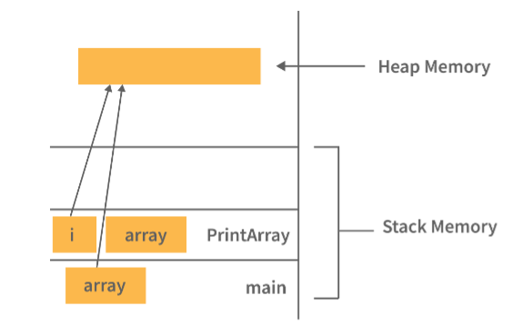

# Java Programming

### What is Java?
Java is a high-level programming language. It is based on the principles of object-orient programming.

### Why is Java platform independent language?
Java was developed in such a way that it does not depend on any hardware or software since the compiler compiles the code and then converts it to platform-independent byte code which can be run on multiple systems.
The only condition to run that byte code is for the machine to have a runtime environment (JRE) installed in it.

Step 1: Compile .java files. It gets convereted into bytecode(.class files), which is not machine-specific.
    
    javac Myclass.java

Step 2: Bytecode is then executed by the JVM(Java Virtual Machine), not directly by the OS. Each platform has its own JVM implementation. The JVM takes the same .class bytecode and translates it into native machine instructions.

### Why is Java not a pure object-oriented language?
Java supports primitive data types - byte, boolean, char, short, int, float, long, and double and hence it is not a pure object oriented language.

### Difference between Heap and Stack Memory in java. And how java utilizes this.
Stack memory is the portion of memory allocated to each thread by the JVM. It has a fixed size, and is used for storing:
* Method calls
* Local variables (including primitives)
* Object references

Since it's limited and managed in a Last-In-First-Out (LIFO) manner, it's very fast but not suitable for dynamic memory needs.

Heap memory, on the other hand, is a larger memory area not pre-assigned to individual programs. It is shared across all threads and is used for:

* Creating Objects
* Class instances
* Arrays

Heap memory is allocated at runtime and managed by the Garbage Collector, which frees memory when objects are no longer referenced.

Utilization of stack and heap memory:
1. When you write and run a Java program, all method calls, local variables, and references to objects are stored in stack memory.
2. When you create an object using new, it is stored in the heap memory.
3. The reference to that object is stored in the stack, allowing your program to access the object in heap.




### Pointers are used in C/ C++. Why does Java not make use of pointers?
Pointers are quite complicated and unsafe to use by beginner programmers. Java focuses on code simplicity, and the usage of pointers can make it challenging. Pointer utilization can also cause potential errors. Moreover, security is also compromised if pointers are used because the users can directly access memory with the help of pointers.

Thus, a certain level of abstraction is furnished by not including pointers in Java. Moreover, the usage of pointers can make the procedure of garbage collection quite slow and erroneous. Java makes use of references as these cannot be manipulated, unlike pointers.

### What do you mean by data encapsulation?
Data Encapsulation is one of the core principles of Object-Oriented Programming (OOP).
It means wrapping the data (variables) and code (methods) together as a single unit, and restricting direct access to some of the object's components.

    Encapsulation is the process of hiding internal details of an object and only exposing what is necessary, usually through public methods (getters/setters).

Java uses access modifiers and getter/setter methods to implement encapsulation.

Benifits of Encapsulation:
1. Data hiding - prevents outside access to internal state
2. Improved security - can control what is set or returned
3. Code flexibility - Can change internal implementation without affecting external code
4. Better maintainability - Encapsulated code is easier to debug and manage.

### Can you tell the difference between equals() method and equality operator(==) in Java?
We are already aware of the (==) equals operator. That we have used this to compare the equality of the values. But when we talk about the terms of object-oriented programming, we deal with the values in the form of objects. And this object may contain multiple types of data. So using the (==) operator does not work in this case. So we need to go with the .equals() method.

Both [(==) and .equals()] primary functionalities are to compare the values, but the secondary functionality is different. (==) Operators compares the memory location. equals() method compares the values and returns the result accordingly.

In the cases where the equals method is not overridden in a class, then the class uses the default implementation of the equals method that is closest to the parent class.
Object class is considered as the parent class of all the java classes. The implementation of the equals method in the Object class uses the == operator to compare two objects. This default implementation can be overridden as per the business logic.


```java
// Example with Primitives
int a = 10;
int b = 10;

System.out.println(a == b);     // true — compares values
```
```java
// Example with Objects(String)
String s1 = new String("hello");
String s2 = new String("hello");

System.out.println(s1 == s2);         // false — different objects in memory
System.out.println(s1.equals(s2));    // true — same content
```
```java
// Example with Custom Class
class Person {
    String name;

    Person(String name) {
        this.name = name;
    }
}

Person p1 = new Person("Arpan");
Person p2 = new Person("Arpan");

System.out.println(p1 == p2);         // false — different objects
System.out.println(p1.equals(p2));    // false — still false unless we override equals()

```

For equals() method to work in custom class we have to override it in our custom class.

```java
// Example with Custom Class
class Person {
    String name;

    Person(String name) {
        this.name = name;
    }
    @Override
    public boolean equals(Object o) {
        if (this == o) return true;
        if (!(o instanceof Person)) return false;
        Person person = (Person) o;
        return this.name.equals(person.name);
    }
}

Person p1 = new Person("Arpan");
Person p2 = new Person("Arpan");

System.out.println(p1 == p2);         // false — different objects
System.out.println(p1.equals(p2));    // true - same content
```

### Briefly explain the concept of constructor overloading
Constructor Overloading is the concept where a class can have multiple constructors with different parameter lists (different number or types of parameters). It allows you to create objects in different ways, depending on what information you have at the time of object creation.

```java
public class Person {
    String name;
    int age;

    // Constructor 1 – no arguments
    public Person() {
        this.name = "Unknown";
        this.age = 0;
    }

    // Constructor 2 – one argument
    public Person(String name) {
        this.name = name;
        this.age = 0;
    }

    // Constructor 3 – two arguments
    public Person(String name, int age) {
        this.name = name;
        this.age = age;
    }
}
```

### Define Copy constructor in java.
A Copy Constructor in Java is a special constructor used to create a new object by copying the data from an existing object of the same class.

```java
public class Person {
    String name;
    int age;

    // Regular constructor
    public Person(String name, int age) {
        this.name = name;
        this.age = age;
    }

    // Copy constructor
    public Person(Person other) {
        this.name = other.name;
        this.age = other.age;
    }
}
```

Copy Constructor is used to clone or duplicate an  object safely. It ensures deep copying instead of using .clone().

`Note:` Java does not provide a default copy constructor. You must define it manually if needed.

### Can the main method be Overloaded?
Yes, It is possible to overload the main method. We can create as many overloaded main methods we want. However, JVM has a predefined calling method that JVM will only call the main method with the definition of – 

    Public static void main(String[] args)

Only `main(String[] args)` is recognized and called automatically by the JVM. All other overloaded versions must be called manually from within the main method or other methods.

### Comment on method overloading and overriding by citing relevant examples.

Method Overloading:

    Method Overloading means defining multiple methods with the same name in the same class, but with different parameter lists (type, number, or order of parameters).

```java
public class Calculator {

    // Method 1
    public int add(int a, int b) {
        return a + b;
    }

    // Method 2: Overloaded with different number of parameters
    public int add(int a, int b, int c) {
        return a + b + c;
    }

    // Method 3: Overloaded with different data types
    public double add(double a, double b) {
        return a + b;
    }
}

```

Method Overriding:

    Method Overriding means providing a new implementation of a method in a subclass that is already defined in the superclass.  

```java
class Animal {
    public void sound() {
        System.out.println("Animal makes a sound");
    }
}

class Dog extends Animal {
    @Override
    public void sound() {
        System.out.println("Dog barks");
    }
}

```

| Feature          | Method Overloading                                  | Method Overriding                            |
| ---------------- | --------------------------------------------------- | -------------------------------------------- |
| **Where?**       | Same class                                          | Between superclass and subclass              |
| **Signature**    | Must differ (parameters)                            | Must be same as superclass method            |
| **Return type**  | Can differ                                          | Must be same (or covariant)                  |
| **Access level** | No restrictions                                     | Cannot reduce visibility                     |
| **Polymorphism** | Compile-time (static)                               | Runtime (dynamic)                            |
| **Use case**     | To perform similar operations with different inputs | To modify behavior inherited from superclass |


### A single try block and multiple catch blocks can co-exist in a Java Program. Explain.
In Java, you can use multiple catch blocks with a single try block to handle different types of exceptions separately. This is useful when the code inside the try block can throw multiple kinds of exceptions, and you want to handle each differently.

The JVM evaluates exceptions top to bottom. The first matching block is executed. Only one catch block runs per exception - others are skipped.

Specific exception should come prior to the general exception because only the first catch block satisfying the catch condition is executed.

### Explain the use of final keyword in variable, method and class.
In Java, the final keyword is a non-access modifier used to restrict the modification of variables, methods, and classes.

`final` Variable:
* When a variable is declared as final in Java, the value can’t be modified once it has been assigned.
* It essentially becomes a constant.
* If not initialized at the time of declaration, it must be initialized in the constructor.

```java
final int x = 10;
x = 20;   // ❌ Compilation error: cannot assign a value to final variable
```

`final` Method:
* A method declared as final cannot be overridden by any subclass.
* Used to prevent modification of core logic in subclass.
* Helpful in securing critical methods.
* Constructors cannot be final, because they are not inherited. Attempting to mark a constructor final will result in a compile-time error.

```java
class Parent {
    final void show() {
        System.out.println("Final method in Parent");
    }
}

class Child extends Parent {
    // void show() {}  // ❌ Error: cannot override final method
}

```

`final` Class:
* A class declared as final cannot be subclassed (inherited).
* Used to prevent the clas from being extended and to preserve its implementation.
* A final class can still extend another class, but nothing can extend it.

```java
final class Vehicle {
    void run() {
        System.out.println("Running");
    }
}

// class Car extends Vehicle {}  // ❌ Error: cannot inherit from final class
```

### Do final, finally and finalize keywords have the same function?
All three keywords have their own utility while programming.

`final`: If any restriction is required for classes, variables, or methods, the final keyword comes in handy. Inheritance of a final class or overriding of a final method is restricted using the final keyword. The variable value becomes fixed after incorporating the final keyword.

```java
final int x = 10;          // x cannot be reassigned
final class A {}           // Cannot be extended
final void method() {}     // Cannot be overridden
```

`finally`: Always executes after try-catch, whether an exception is thrown or not. Useful for resource cleanup like closing files, database conenctions, etc.

```java
try {
    int a = 10 / 0;
} catch (Exception e) {
    System.out.println("Exception caught");
} finally {
    System.out.println("This block always runs");
}
```

`finalize()`: This is a method of the Object class, called by the Garbage Collector before destroying an object - used to perform cleanup operations. Deprecated and not recommednded in modern Java(use AutoClosable or try-with-resources instead).

```java
@Override
protected void finalize() throws Throwable {
    System.out.println("Object is being garbage collected");
}
```

### Is it possible that the ‘finally’ block will not be executed? If yes then list the case.

Yes, although the finally block is almost always executed, there are a few rare cases where it will not execute. By default, finally block executes always - even if there is an exception or return statement. But it will not execute in the following special cases:

| # | Scenario                             | Description                                                                                                          |
| - | ------------------------------------ | -------------------------------------------------------------------------------------------------------------------- |
| 1 | `System.exit()` is called            | If the program exits explicitly using `System.exit()`, the JVM terminates immediately — skipping `finally`.          |
| 2 | Infinite loop or crash               | If the JVM crashes or the program goes into an infinite loop before reaching `finally`.                              |
| 3 | Power failure / OS crash             | If the system shuts down abruptly or the process is forcibly killed.                                                 |
| 4 | `kill -9` or force stop              | In native environments, if the Java process is killed forcefully (e.g., `kill -9` in Unix/Linux), finally won't run. |
| 5 | Error in `finally` before completion | If an exception occurs **inside** the `finally` block and is **not handled**, the block may terminate prematurely.   |


### When can you use super keyword?
The super keyword is used in Java to refer to the immediate parent class of a subclass. It's especially useful when the subclass wants to:
1. Access parent class data members - When a subclass has a field with the same name as the parent class, super helps distinguish between them.
```java
class Parent {
    int x = 100;
}

class Child extends Parent {
    int x = 200;

    void display() {
        System.out.println("Child x: " + x);        // 200
        System.out.println("Parent x: " + super.x); // 100
    }
}

```
2. Invoke parent class methods - If the subclass overrides a method from the parent, you can still call the parent version using super.
```java
class Parent {
    void show() {
        System.out.println("Parent method");
    }
}

class Child extends Parent {
    void show() {
        super.show();  // Calls Parent's version
        System.out.println("Child method");
    }
}

```
3. Call parent constructor - You can use super() to invoke the parent class's constructor from the child class's constructor. It must be the first statement in the child class constructor.

```java
class Parent {
    Parent() {
        System.out.println("Parent default constructor");
    }

    Parent(String msg) {
        System.out.println("Parent parameterized constructor: " + msg);
    }
}

class Child extends Parent {
    // Calls Parent default constructor
    Child() {
        super();  // Optional, Java calls it implicitly if no super() is written
        System.out.println("Child default constructor");
    }

    // Calls Parent parameterized constructor
    Child(String msg) {
        super(msg);  // Must be the first statement
        System.out.println("Child parameterized constructor: " + msg);
    }
}


```

### Can the static methods be overridden?
No, static methods cannot be overridden in Java — they are bound at compile-time and belong to the class, not to an instance of the class. In Java, method overriding is based on runtime polymorphism, which works only with instance methods. Static methods are resolved using the reference type, not the actual object.

If a subclass defines a static method with the same signature as a static method in its superclass, it is called method hiding, not overriding.

### Difference between static methods, static variables, and static classes in java.

`static` Variable:
* Shared by all instances of a class.
* Memory is allocated once per class, not per object.

```java
class Student {
    static String school = "ABC School";  // Static variable
    String name;

    Student(String name) {
        this.name = name;
    }

    void show() {
        System.out.println(name + " goes to " + school);
    }
}

Student s1 = new Student("Ram");
Student s2 = new Student("Shyam");
s1.show();  // Ram goes to ABC School
s2.show();  // Shyam goes to ABC School

```

`static` Methods:
* Belongs to the class and not instances.
* Can be called without creating an object.
* Cannot access non-static members directy (must use object reference).
* Commonly used for utility or helper methods.

```java
class MathUtils {
    static int square(int x) {
        return x * x;
    }
}
int result = MathUtils.square(5);  // No object needed
System.out.println(result);  // 25
```

`static` Classes:
* Only nested classes (inner classes) can be declared static.
* a static nested class does not need a reference to the outer class.
* Can only access static members of the outer class.

```java
class Outer {
    static int outerValue = 10;

    static class Inner {
        void show() {
            System.out.println("Outer value is " + outerValue);
        }
    }
}
Outer.Inner obj = new Outer.Inner();
obj.show();  // Outer value is 10

```

### What is a ClassLoader?
In Java, a ClassLoader is a part of the Java Runtime Environment (JRE) that dynamically loads classes into memory during runtime.

Java uses ClassLoaders to load .class files (compiled bytecode) when they are referenced for the first time in a program — not at the start of the application.

Java supports dynamic class loading — i.e., it doesn’t load all classes at once. Instead, it loads them on demand, saving memory and improving efficiency.

### What are shallow copy and deep copy in java?
In Java, shallow copy and deep copy refer to two different ways of copying objects, especially those containing reference-type fields (like other objects or arrays).

Shallow Copy - A shallow copy copies the field values as-is. If the field is a primitive, it copies the value. If it's a reference, it copies the reference - meaning both objects will point to the same referenced object.

```java
class Address {
    String city;
    Address(String city) {
        this.city = city;
    }
}

class Person implements Cloneable {
    String name;
    Address address;

    Person(String name, Address address) {
        this.name = name;
        this.address = address;
    }

    public Object clone() throws CloneNotSupportedException {
        return super.clone(); // shallow copy
    }
}

public class Main {
    public static void main(String[] args) throws Exception {
        Address addr = new Address("Mumbai");
        Person p1 = new Person("Arpan", addr);
        Person p2 = (Person) p1.clone();

        p2.name = "Rohan";
        p2.address.city = "Delhi"; // affects p1 too!

        System.out.println(p1.address.city); // Output: Delhi
    }
}
```

Deep Copy - A deep copy cpoes everything - including recursively cloning referenced objects - so the copy is completely independent of the original.

```java
class Address implements Cloneable {
    String city;

    Address(String city) {
        this.city = city;
    }

    public Object clone() throws CloneNotSupportedException {
        return super.clone(); // primitive String, so shallow here is fine
    }
}

class Person implements Cloneable {
    String name;
    Address address;

    Person(String name, Address address) {
        this.name = name;
        this.address = address;
    }

    public Object clone() throws CloneNotSupportedException {
        Person cloned = (Person) super.clone();
        cloned.address = (Address) address.clone(); // deep copy
        return cloned;
    }
}

public class Main {
    public static void main(String[] args) throws Exception {
        Address addr = new Address("Mumbai");
        Person p1 = new Person("Arpan", addr);
        Person p2 = (Person) p1.clone();

        p2.address.city = "Delhi"; // does NOT affect p1

        System.out.println(p1.address.city); // Output: Mumbai
    }
}

```

### What are the reasons behind making strings immutable in Java?

1. Security - Strongs are widely used in security-sensitive operations, such as:
    * File Paths
    * Network connections(hostname, URLs)
    * Class Loading (via Class.forName("...))

    If strings were mutable, a malicoious piece of code could change the value after it's been validated, which would cause security breaches.

2. String Pooling (Performance & Memory Efficiency) - Java uses a String Pool in the heap to store unique string literals. If strings were mutable, changing "Hello" in one place could unintentionally change it everywhere in the pool. Immutability allows safe sharing of strings across the application without copies.

3. Thread Safety - Since Stirng objects can't be modified after creation, they are authomatically thread-safe. Multiple threads can share the same string without synchronization.

4. Caching of HashCode - String is often used as a key in hash-based collection(HashMap, HashSet). Its hashCode is cached after being computed the first time. If strings were mutable, the hash code could change after insertion, breaking the integrity of hash collections.

### What is a singleton class in Java? And how to implement a singleton class?
A Singleton class in Java is a class that allows only one instance of itself to be created throughout the entire JVM lifecycle. It provides a global point of access to that single instance.

Key Features:
1. Only one object exists for the entire application.
2. Constructor is private (to prevent direct instantiation).
3. Has a static method to provide access to the single instance.
4. Often used in scenations like:
    * Configuration managers
    * Database connection pools
    * Loggin frameworks
5. Resource Sharing - avoids creating multiple costly objects
6. Centralized control - same object can be used across the app
7. Thread safety - ensures consistent data access.

Implementation:
1. Eager Initialization
    * Pros - Simple, thread-safe by default.
    * Cons - Instance is created even if it's never used.   
```java
class Singleton {
    // Step 1: Create a private static instance
    private static final Singleton instance = new Singleton();
    
    // Step 2: Private constructor to prevent instantiation
    private Singleton() {
        System.out.println("Singleton instance created");
    }
    
    // Step 3: Public method to provide access
    public static Singleton getInstance() {
        return instance;
    }
}

public class Main {
    public static void main(String[] args) {
        Singleton obj1 = Singleton.getInstance();
        Singleton obj2 = Singleton.getInstance();
        
        System.out.println(obj1 == obj2); // true
    }
}
```

2. Lazy Initialization
    * Pros - Instance created only when needded
    * Cons - Not safe in multi-threaded environments.
```java
class Singleton {
    private static Singleton instance;
    
    private Singleton() {}
    
    public static Singleton getInstance() {
        if (instance == null) {
            instance = new Singleton();
        }
        return instance;
    }
}

```

3. Thread-Safe Singleton (Double-Checked Locking)
    * Pros - Lazy, thread-safe, and efficient.
    * Cons - Slightly more complex code
```java
class Singleton {
    private static volatile Singleton instance;
    
    private Singleton() {}
    
    public static Singleton getInstance() {
        if (instance == null) {
            synchronized (Singleton.class) {
                if (instance == null) {
                    instance = new Singleton();
                }
            }
        }
        return instance;
    }
}

```

### How would you differentiate between a String, StringBuffer, and a StringBuilder?

| Feature           | **String**                                                         | **StringBuffer**                                  | **StringBuilder**                                     |
| ----------------- | ------------------------------------------------------------------ | ------------------------------------------------- | ----------------------------------------------------- |
| **Mutability**    | **Immutable** — once created, cannot be changed.                   | **Mutable** — can be modified after creation.     | **Mutable** — can be modified after creation.         |
| **Thread Safety** | Thread-safe (immutable by nature).                                 | **Thread-safe** — methods are synchronized.       | **Not thread-safe** — no synchronization.             |
| **Performance**   | Slower for frequent modifications (creates new objects each time). | Slower than StringBuilder due to synchronization. | Faster than StringBuffer because it’s unsynchronized. |
| **Package**       | `java.lang.String`                                                 | `java.lang.StringBuffer`                          | `java.lang.StringBuilder`                             |


### Using relevant properties highlight the differences between interfaces and abstract classes.


| **Property**                     | **Interface**                                                                | **Abstract Class**                                                          |
| -------------------------------- | ---------------------------------------------------------------------------- | --------------------------------------------------------------------------- |
| **Methods (Java ≤ 7)**           | Only abstract methods (no body).                                             | Can have abstract and concrete methods.                                     |
| **Methods (Java 8+)**            | Can have `default` methods (with body) and `static` methods.                 | Can have both abstract and concrete methods.                                |
| **Fields**                       | By default: `public static final` (constants).                               | Can have instance variables (any access modifier).                          |
| **Constructors**                 | Not allowed.                                                                 | Allowed (for subclass initialization).                                      |
| **Multiple Inheritance**         | A class can **implement multiple interfaces**.                               | A class can **extend only one abstract class**.                             |
| **Access Modifiers for Methods** | All methods are **public** by default.                                       | Methods can be `public`, `protected`, or `private`.                         |
| **State (Instance Variables)**   | Cannot maintain state (no instance fields).                                  | Can maintain state (instance variables).                                    |
| **Implementation**               | A class **must** implement all abstract methods unless it’s abstract itself. | A subclass must implement all abstract methods unless it’s abstract itself. |
| **When to Use**                  | To define a contract (capabilities) without caring about implementation.     | To provide a base class with partial implementation + shared state.         |


```java
// Interface example
interface Vehicle {
    int MAX_SPEED = 120; // public static final by default
    void start();        // public abstract by default
}

// Abstract class example
abstract class Car {
    String model; // Instance variable
    abstract void drive(); // Abstract method
    void stop() {          // Concrete method
        System.out.println("Car stopped");
    }
}
```

### What is a Comparator in java?
A Comparator in Java is an interface from the java.util package that is used to define a custom sorting order for objects.

Unlike the Comparable interface (which defines the natural ordering inside the class itself), Comparator is typically implemented outside the class so you can have multiple different sorting strategies for the same type of object.

`int compare(T o1, T o2);`

It is a functional interface that returns:
* Negative -> if `o1` should come before `o2`
* Zero -> if `o1` and `o2` are equal in ordering
* Positive -> if `o1` should come after `o2`

Example:
```java
import java.util.*;

class Student {
    String name;
    int age;

    Student(String name, int age) {
        this.name = name;
        this.age = age;
    }
}

// Comparator for sorting by name
class NameComparator implements Comparator<Student> {
    public int compare(Student s1, Student s2) {
        return s1.name.compareTo(s2.name);
    }
}

// Comparator for sorting by age
class AgeComparator implements Comparator<Student> {
    public int compare(Student s1, Student s2) {
        return s1.age - s2.age;
    }
}

public class Main {
    public static void main(String[] args) {
        List<Student> list = Arrays.asList(
            new Student("Ravi", 23),
            new Student("Amit", 21),
            new Student("Vikram", 25)
        );

        Collections.sort(list, new NameComparator());
        System.out.println("Sorted by Name:");
        list.forEach(s -> System.out.println(s.name + " - " + s.age));

        Collections.sort(list, new AgeComparator());
        System.out.println("\nSorted by Age:");
        list.forEach(s -> System.out.println(s.name + " - " + s.age));
    }
}

```

### What makes a HashSet different from a TreeSet?
A HashSet and a TreeSet in Java are both implementation of the Set interface, but they differ in ordering, performance, and underlying data structure.

1. Underlying Data Structure
    * HashSet - Uses a HashMap internally (hash table)
    * TreeSet - Uses a TreeMap internally (red-black tree)

2. Ordering
    * HashSet - Unordered; elements are stored based on hash code, so order may change over time.
    * TreeSet - Sorted in natural order (or by a custom Comparator).

3. Null Elements
    * HashSet - Allows one null element.
    * TreeSet - Does not alow null (throws `NullPointerException` if you try to add).

4. Performance:
    * HashSet - Add/Remove/Search takes O(1) average (hashing)
    * TreeSet - Add/Remove/Search takes O(log n) (tree traversal)

### What are the differences between HashMap and HashTable in Java?

1. Thread Safety
    * HashMap - Not synchronized (not thread-safe). If multiple threads access it simultaneously and at least one modifies it, external synchronization is needed.
    * HashTable - Synchronized (thread-safe). Only one thread can access it at a time.

2. Null Keys & Values
    * HashMap - Allows one null key and multiple null values.
    * HashTable - Does not allow null keys or null values.

3.  Performance
    * HashMap - Faster because it's not synchronized.
    * HashTable - Slower due to synchronized methods.

4. Iteration
    * HashMap - Uses Iterator (fail-fast -> thros `ConcurrentModificationException` if modified during iteration)
    * HashTable - Uses Enumeration (not fail-fast) and also supports Iterator in newer versions.

5. Inheritance
    * HashMap - Extends `AbstractMap<K,V>`
    * HashTable - Extends `Dictionary<K,V>`

6. Ordering
    * HashMap - Supports order of insertion by making use of its subclass `LinkedHashMap`
    * HashTable - Order of insertion is not guaranteed.

### What are the different ways of thread usage?

