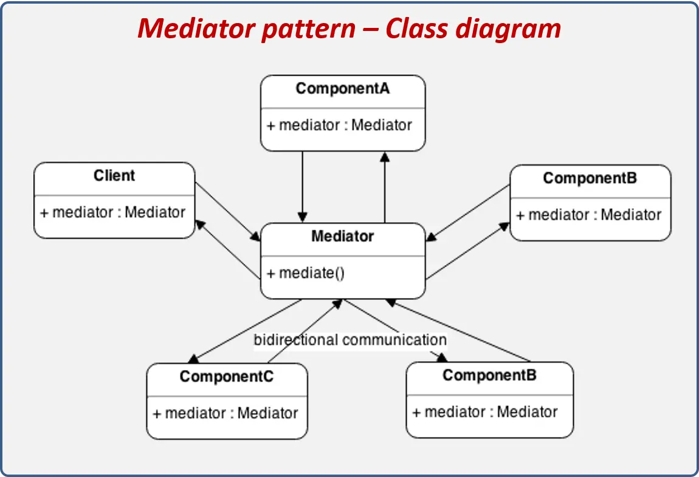

# Software Design and Architecture
Resource - (https://roadmap.sh/software-design-architecture)

## Clean Code Principles

Clean code is code that is easy to read, understand, and maintain. It follows a set of principles that are designed to make the code more readable, testable, and less error-prone. Some of the key principles of clean code include:

* **Clarity:** The code should be easy to read and understand.
* **Simplicity:** The code should be as simple as possible, avoiding unnecessary complexity.
* **Comments:** Comments should be used sparingly and only when necessary to explain complex or non-obvious code.
* **Naming:** Variables, functions, and classes should have meaningful and descriptive names.
* **Formatting:** The code should be consistently formatted to improve readability.
* **Functionality:** The code should be organized into small, single-purpose functions and classes.
* **Error handling:** The code should handle errors in a consistent and predictable way.
* **Testing:** The code should be testable and have a high test coverage.
* **Reusability:** The code should be designed to be reusable and modular.
* **Performance:** The code should be designed to be efficient and performant.


#### Additional Resources
* [Introduction to Clean Code & Software Design Principles](https://workat.tech/machine-coding/tutorial/introduction-clean-code-software-design-principles-nwu4qqc63e09)
* [10 Tips to Clean Code](https://www.pluralsight.com/resources/blog/software-development/10-steps-to-clean-code)
* [How to reduce cyclomatic complexity and make code more readable](https://kasp9023.medium.com/how-to-make-your-code-more-readable-focus-on-the-happy-path-and-reduce-cyclomatic-complexity-66802b8897b5)
* [Clean Architecture](https://pusher.com/tutorials/clean-architecture-introduction/)


## Programming Paradigms
A programming paradigm is a fundamental style or approach to solving problems using a programming language. Different programming paradigms provide different ways of organizing and structuring code, and have different strengths and weaknesses. Some of the most common programming paradigms include:

* Imperative programming
* Functional programming
* Object-oriented programming
* Logic programming
* Declarative programming


#### Additional Resources
* [What is functional programming?](https://medium.com/javascript-scene/master-the-javascript-interview-what-is-functional-programming-7f218c68b3a0)
* [What is Object Oriented Programming](https://www.freecodecamp.org/news/what-is-object-oriented-programming/)


## Object Oriented Programming
Object-oriented programming (OOP) is a programming paradigm that is based on the concept of "objects," which are instances of a class. In OOP, a class is a blueprint for creating objects, which have both data (attributes) and behavior (methods). The main idea behind OOP is to model real-world objects and their interactions, making it well-suited for creating complex and large-scale software systems.

### Primary Principles of OOPs

1. **Inheritance:**
    Inheritance is a fundamental concept in object-oriented programming (OOP) that allows a new class to inherit the properties and methods of an existing class. The class that is inherited from is called the parent or super class, while the class that inherits is called the child or sub class. Inheritance enables code reuse and allows for a hierarchical organization of classes, where a child class can inherit the properties and methods of its parent class and potentially add or override them. The main advantage of inheritance is that it allows for a clean and organized way to reuse code and share functionality among classes.

2. **Polymorphism:**
    Polymorphism is a concept in object-oriented programming (OOP) that allows objects of different classes to be treated as objects of a common parent class. This is achieved by defining a common interface for all classes that need to be treated polymorphically. The word polymorphism is derived from Greek, "poly" means many and "morph" means form. There are two types of polymorphism:

    * Compile-time polymorphism (also called static polymorphism or early binding) occurs when the type of the object that is going to be acted upon is determined at compile-time. This is achieved through method overloading, which allows multiple methods to have the same name but different parameters within the same class.
    * Run-time polymorphism (also called dynamic polymorphism or late binding) occurs when the type of the object is determined at run-time. This is achieved through method overriding, which allows a child class to provide a specific implementation of a method that is already defined in its parent class.

3. **Abstraction:** 
    Abstraction is a concept in object-oriented programming (OOP) that refers to the process of hiding the implementation details of an object and exposing only its essential features. It enables the use of objects without the need to understand the underlying complexity of their internal structure and behavior. There are two types of abstraction:

    * Data abstraction: refers to hiding the internal representation of data and providing a simplified view of the data through a set of well-defined interfaces.
    * Behavioral abstraction: refers to hiding the internal behavior of an object and providing a simplified view of its capabilities through a set of well-defined interfaces.

4. **Encaplsulation:** 
    Encapsulation is a concept in object-oriented programming (OOP) that refers to the practice of wrapping an object's internal data and behavior within a defined interface, and hiding the implementation details from the outside world. It is one of the fundamental concepts of OOP and is closely related to the concepts of data hiding and information hiding.
    Encapsulation is achieved by using access modifiers (such as "public," "private," and "protected") to control the visibility and accessibility of an object's data and methods. For example, data members of a class can be declared as private, which means they can only be accessed by methods within the class, while methods can be declared as public, which means they can be called by any code that has a reference to the object.


### Paradigm Features

1. **Abstract Classes:**
    An abstract class is a class in object-oriented programming (OOP) that cannot be instantiated. Instead, it serves as a template or blueprint for other classes to inherit from. An abstract class can contain both abstract and non-abstract methods (abstract methods are methods that do not have any implementation, they just have a signature). Abstract classes are used to provide a common interface and implementation for a group of related classes. They are also used to define common behavior that must be implemented by all subclasses. A subclass that inherits from an abstract class is called a concrete class, and it must provide an implementation for all the abstract methods declared in the parent class.

2. **Concrete Classes:** 
    A concrete class is a class in object-oriented programming (OOP) that can be instantiated, meaning objects can be created from it. A concrete class is a class that provides an implementation for all of the abstract methods declared in its parent class, if it inherits from an abstract class. A concrete class can also be a class that does not inherit from an abstract class, in that case it can have implementation for all of its methods.
    Concrete classes are used to provide specific implementation details for a group of related classes that inherit from a common abstract class. They are also used to define unique behavior for a specific class. A concrete class can have its own methods and variables, and can also override the methods of its parent class.

3. **Scope/Visibility:**
    Scope visibility refers to the accessibility or visibility of variables, functions, and other elements in a program, depending on the context in which they are defined. In object-oriented programming (OOP), scope visibility is controlled through the use of access modifiers, such as "public," "private," and "protected."

    * Public: A public element can be accessed from anywhere in the program, both within the class and outside of it.
    * Private: A private element can only be accessed within the class in which it is defined. It is not accessible to other classes, even if they inherit from the class.
    * Protected: A protected element can only be accessed within the class and its subclasses.

4. **Interfaces:** 
    In object-oriented programming (OOP), an interface is a contract or a set of methods that a class must implement. It defines a common set of methods that a class must provide, but it does not provide any implementation details. An interface can include both method signatures and constants. Interfaces are used to define a common behavior for a group of related classes, and to provide a way for objects of different classes to be treated polymorphically. A class that implements an interface must provide an implementation for all of the methods declared in the interface. A class can implement multiple interfaces, but can only inherit from one base class.

### Model-Driven Design

#### Domain Models
A domain model is a representation of a specific area of knowledge or business that is used to model the objects and concepts within that domain, and to capture the relationships and constraints between them. In object-oriented programming (OOP), a domain model is typically represented by a set of classes and interfaces, with each class or interface representing a specific concept or object within the domain.

A domain model is used to provide a clear and consistent representation of the problem domain, and to capture the business requirements and constraints of the system. It is also used to guide the design of the system and to ensure that the system accurately reflects the real-world problem it is intended to solve.

#### Anemic Models
An Anemic model, also known as an anemic domain model, is a type of domain model in which the domain objects only contain data (attributes) and lack behavior. An anemic model often results in the use of data-transfer objects (DTOs) and service layer to handle the behavior.

An anemic model is considered an anti-pattern in object-oriented programming (OOP) because it violates the principles of encapsulation and separation of concerns. In an anemic model, the behavior is separated from the data, and is typically implemented in a separate service layer, which can lead to a complex, tightly coupled, and hard-to-maintain codebase.

#### Domain Language
A domain language is a specific vocabulary and set of concepts used to describe and communicate about a specific area of knowledge or business. In software development, a domain language is used to model the objects and concepts within a specific domain, and to capture the relationships and constraints between them.

A domain language is used to provide a common understanding of the problem domain among all stakeholders, including developers, business analysts, and domain experts. It is also used to ensure that the software system accurately reflects the real-world problem it is intended to solve.

#### Class Invariants
A class invariant is a set of conditions that must be true for any object of a class, at any point in time. In object-oriented programming (OOP), class invariants are used to define the valid states of an object and to ensure that the object always remains in a valid state.

Class invariants are typically defined in the constructor of a class and are enforced through the use of private methods and data members that are used to validate the state of the object. They are also checked in the class's methods before and after any operation that can change the state of the object.

#### Layered Architecture
A layered architecture is a software design pattern in which the functionality of a system is divided into a set of layers, with each layer having a specific responsibility and interacting with the layers above and below it. The main idea behind a layered architecture is to separate the concerns of the system into distinct and independent layers, making the code more modular, easier to understand, test, and modify.

There are several types of layered architectures, but a common one is the three-layer architecture which consists of:
* Presentation Layer
* Business Layer
* Data Access Layer

#### Additional Resources:
* Primary Principles of OOPs
    * [Inheritance](https://en.wikipedia.org/wiki/Inheritance_(object-oriented_programming))
    * [Polymorphism](https://www.bmc.com/blogs/polymorphism-programming/)
    * [Encapsulation](https://en.wikipedia.org/wiki/Encapsulation_(computer_programming))

* Paradigm Features
    * [Abstact Classes](https://www.theserverside.com/definition/abstract-class)

* Model-Driven Design
    * [Domain Model](https://en.wikipedia.org/wiki/Domain_model)
    * [Anemic Model](https://en.wikipedia.org/wiki/Anemic_domain_model)
    * [Software Architecture Patterns — Layered Architecture](https://priyalwalpita.medium.com/software-architecture-patterns-layered-architecture-a3b89b71a057)


## Design Principles

### SOLID
SOLID programming design is a philosophy and approach to creating more robust, flexible, and scalable software systems that maintain integrity over time. As a developer, it is important to understand the right way and wrong way to write code. In this article, we will detail each of the SOLID design principles in context so that you can apply them to your work.

SOLID is a popular set of design principles that developers use when creating object-oriented software. SOLID is an acronym that stands for five key design principles:

* **S**ingle responsibility principle - "A class should have one, and only one, reason to change."
* **O**pen-closed principle - “A class should be open for extension but close for modification.”
* **L**iskov substitution principle - "Subclasses should be substituted for their Base classes.”
* **I**nterface segregation principle - "Many client specific interfaces are better than one general purpose interface. Client should not be forced to implement methods they don't need."
* **D**ependency inversion principle - "High level modules should not depend upon low level modules. Both should depend on abstractions…abstractions should not depend on details. Details should depend upon abstractions."

### DRY
DRY (Don't Repeat Yourself) is a software development principle that suggests that code should not have duplicate functionality. The idea is to keep the codebase as simple as possible by eliminating redundancy and duplication. The goal is to reduce complexity and improve maintainability by ensuring that each piece of knowledge is expressed in a single, unambiguous way within the system.

The DRY principle is closely related to the Single Responsibility Principle (SRP) and the Open-Closed Principle (OCP), which are part of the SOLID principles. The DRY principle aims to reduce the amount of duplicate code by creating abstractions that can be reused across the system.

### YAGNI
YAGNI (You Ain't Gonna Need It) is a software development principle that suggests that developers should not add functionality to a codebase unless it is immediately necessary. The idea is to avoid creating unnecessary complexity in the codebase by only adding features that are actually needed.

The YAGNI principle is closely related to the Single Responsibility Principle (SRP) and the Open-Closed Principle (OCP), which are part of the SOLID principles. YAGNI aims to keep the codebase as simple as possible by avoiding the creation of unnecessary abstractions and functionality.

### Composition over Inheritance
Composition over inheritance is a programming principle that suggests that it is better to use composition, a mechanism for assembling objects, to create complex objects, rather than using inheritance, which is a mechanism for creating new classes based on existing ones.

Inheritance is a powerful mechanism for creating reusable code, but it can also lead to tightly coupled, hard-to-maintain code. This is because inherited classes are tightly bound to their parent classes and any changes made to the parent class will affect all of its child classes. This makes it hard to change or extend the code without affecting the entire class hierarchy.

#### Additional Resources:
* [SOLID Principles in Object Oriented Design](https://www.bmc.com/blogs/solid-design-principles/)
* [Solid Principles](https://khalilstemmler.com/articles/solid-principles/solid-typescript/)


## Design Patterns
Design patterns are general solutions to common problems that arise in software development. They provide a way to describe and communicate proven solutions to common design problems and they provide a common vocabulary for design. They are not specific to any particular programming language or technology, but rather describe the problem and the solution in a way that can be applied to many different contexts.

There are several different types of design patterns, including:

* Creational patterns
* Structural patterns 
* Behavioral patterns
* Architectural patterns

### Creational Patterns
Creational design patterns provide various object creation mechanisms, which increase flexibility and reuse of existing code.

#### 1. Singleton
Singleton is a creational design pattern that lets you ensure that a class has only one instance, while providing a global access point to this instance.

All implementation of Singleton have two steps in common:
1. Make the default constructor private, to prevent other objects from using the new operator with the Singleton class.
2. Create a static creation method that acts as a constructor. Under the hood, this method calls the private constructor to create an object and saves it in a static field. All following calls to this method return the cached object.


The Singleton class declares the static method `getInstance` that returns the same instance of its own class.

The Singleton’s constructor should be hidden from the client code. Calling the `getInstance` method should be the only way of getting the Singleton object.

Different approaches to singleton pattern implementation:

1. Eager Initialization:
    The instance of the singleton class is created at the time of class loading. The drawback to eager initialization is that the method is created even though the client application might not be using it.

```java
public class EagerInitializedSingleton {

    private static final EagerInitializedSingleton instance = new EagerInitializedSingleton();

    // private constructor to avoid client applications using the constructor
    private EagerInitializedSingleton(){}

    public static EagerInitializedSingleton getInstance() {
        return instance;
    }
}
```

2. Static Block Initialization:
    Static block initialization implementation is similar to eager initialization, except that instance of the class is created in the static block that provides the option for exception handling.

```java
public class StaticBlockSingleton {

    private static StaticBlockSingleton instance;

    private StaticBlockSingleton(){}

    // static block initialization for exception handling
    static {
        try {
            instance = new StaticBlockSingleton();
        } catch (Exception e) {
            throw new RuntimeException("Exception occurred in creating singleton instance");
        }
    }

    public static StaticBlockSingleton getInstance() {
        return instance;
    }
}
```

3. Lazy Initialization:
    Lazy initialization method to implement the singleton pattern creates the instance in the global access method. This implementation works fine in the case of the single-threaded environment, but when it comes to multi-threaded systems, it can cause issues if multiple threads are inside the if condition at the same time. It will destroy the singleton pattern and both threads will get different instances of the singleton class.

```java
public class LazyInitializedSingleton {

    private static LazyInitializedSingleton instance;

    private LazyInitializedSingleton(){}

    public static LazyInitializedSingleton getInstance() {
        if (instance == null) {
            instance = new LazyInitializedSingleton();
        }
        return instance;
    }
}
```

4. Thread Safe Singleton:
A simple way to create a thread-safe singleton class is to make the global access method synchronized so that only one thread can execute this method at a time. The implementation works fine and provides thread-safety, but it reduces the performance because of the cost associated with the synchronized method.

```java
public class ThreadSafeSingleton {

    private static ThreadSafeSingleton instance;

    private ThreadSafeSingleton(){}

    public static synchronized ThreadSafeSingleton getInstance() {
        if (instance == null) {
            instance = new ThreadSafeSingleton();
        }
        return instance;
    }

}
```

5. Bill Pugh Singleton Implemntation: 
    Prior to Java 5, the Java memory model had a lot of issues, and the previous approaches used to fail in certain scenarios where too many threads tried to get the instance of the singleton class simultaneously. So Bill Pugh came up with a different approach to create the singleton class using an inner static helper class. Notice the private inner static class that contains the instance of the singleton class. When the singleton class is loaded, SingletonHelper class is not loaded into memory and only when someone calls the getInstance() method, this class gets loaded and creates the singleton class instance. This is the most widely used approach for the singleton class as it doesn’t require synchronization.

```java
public class BillPughSingleton {

    private BillPughSingleton(){}

    private static class SingletonHelper {
        private static final BillPughSingleton INSTANCE = new BillPughSingleton();
    }

    public static BillPughSingleton getInstance() {
        return SingletonHelper.INSTANCE;
    }
}
```

#### 2. Factory
The factory design pattern is used when we have a superclass with multiple sub-classes and based on input, we need to return one of the sub-class. This pattern takes out the responsibility of the instantiation of a class from the client program to the factory class.


1. Computer (Super Class) - Super class in factory design pattern can be an interface, abstract class or a normal java class.
2. PC (Subclass 1), Server(Subclass 2)
3. ComputerFactory (Factory Class) 

Some important points about Factory Design Pattern method are:
1. We can keep Factory class Singleton or we can keep the method that returns the subclass as static
2. Notice that based on the input parameter, different subclass is created and returned. getComputer is the factory method.

Example:

```java
// Superclass
public abstract class Computer {
	public abstract String getRAM();
	public abstract String getHDD();
	public abstract String getCPU();
}

//Subclass 1
public class PC extends Computer {
	private String ram;
	private String hdd;
	private String cpu;

	public PC(String ram, String hdd, String cpu){
		this.ram=ram;
		this.hdd=hdd;
		this.cpu=cpu;
	}
}

// Subclass 2
public class Server extends Computer {
	private String ram;
	private String hdd;
	private String cpu;
	
	public Server(String ram, String hdd, String cpu){
		this.ram=ram;
		this.hdd=hdd;
		this.cpu=cpu;
	}
}

// Factory Class
public class ComputerFactory {

	public static Computer getComputer(String type, String ram, String hdd, String cpu){
		if("PC".equalsIgnoreCase(type)) return new PC(ram, hdd, cpu);
		else if("Server".equalsIgnoreCase(type)) return new Server(ram, hdd, cpu);
		
		return null;
	}
}
```

#### 3. Abstract Factory
In the Abstract Factory pattern, we get rid of if-else block and have a factory class for each sub-class. Then an Abstract Factory class that will return the sub-class based on the input factory class. 


```java
// Product interface
interface Pizza {
    void prepare();
    void bake();
    void cut();
    void box();
}

// ConcreteProduct implementations
class MargheritaPizza implements Pizza {
    // Implementations of Pizza methods
}

class PepperoniPizza implements Pizza {
    // Implementations of Pizza methods
}

// Creator interface
interface PizzaFactory {
    Pizza createPizza();
}

// ConcreteCreator implementations
class MargheritaPizzaFactory implements PizzaFactory {
    @Override
    public Pizza createPizza() {
        return new MargheritaPizza();
    }
}

class PepperoniPizzaFactory implements PizzaFactory {
    @Override
    public Pizza createPizza() {
        return new PepperoniPizza();
    }
}

// Client code
public class PizzaStore {
    public static void main(String[] args) {
        PizzaFactory pizzaFactory = new MargheritaPizzaFactory();
        Pizza pizza = pizzaFactory.createPizza();
        // Use the pizza object
    }
}

```

Abstract Factory pattern is “factory of factories” and can be easily extended to accommodate more products, for example we can add another sub-class Laptop and a factory LaptopFactory.

#### 4. Builder
Builder pattern was introduced to solve some of the problems with Factory and Abstract Factory design patterns when the Object contains a lot of attributes. There are three major issues with Factory and Abstract Factory design patterns when the Object contains a lot of attributes.

1. Too Many arguments to pass from client program to the Factory class that can be error prone because most of the time, the type of arguments are same and from client side its hard to maintain the order of the argument.
2. Some of the parameters might be optional but in Factory pattern, we are forced to send all the parameters and optional parameters need to send as NULL.
3. If the object is heavy and its creation is complex, then all that complexity will be part of Factory classes that is confusing.

Builder pattern solves the issue with large number of optional parameters and inconsistent state by providing a way to build the object step-by-step and provide a method that will actually return the final Object.


Implementation of builder pattern:

*Step 1: Define the product* 
```java
public class Pizza {
    private String dough;
    private String sauce;
    private String topping;

    // Constructor and getters
}
```

*Step 2: Create the Builder interface*
```java
public interface PizzaBuilder {
    PizzaBuilder buildDough(String dough);
    PizzaBuilder buildSauce(String sauce);
    PizzaBuilder buildTopping(String topping);
    Pizza build();
}
```

*Step 3: Implement the Concrete Builder*
```java
public class SpicyPizzaBuilder implements PizzaBuilder {
    private Pizza pizza;

    public SpicyPizzaBuilder() {
        this.pizza = new Pizza();
    }

    @Override
    public PizzaBuilder buildDough(String dough) {
        pizza.setDough(dough);
        return this;
    }

    @Override
    public PizzaBuilder buildSauce(String sauce) {
        pizza.setSauce(sauce);
        return this;
    }

    @Override
    public PizzaBuilder buildTopping(String topping) {
        pizza.setTopping(topping);
        return this;
    }

    @Override
    public Pizza build() {
        return pizza;
    }
}
```

*Step 4: Create the director (Optinal)*
```java
public class Director {
    private PizzaBuilder pizzaBuilder;

    public Director(PizzaBuilder pizzaBuilder) {
        this.pizzaBuilder = pizzaBuilder;
    }

    public Pizza constructPizza() {
        return computerBuilder
            .buildDough("Thin Crust")
            .buildSauce("Spicy Tandoori")
            .buildTopping("Chicken")
            .build();
    }
}
```

*Step 5: Client Code*
```java
public class Client {
    public static void main(String[] args) {
        PizzaBuilder spicyPizzaBuilder = new SpicyPizzaBuilder();
        Director director = new Director(spicyPizzaBuilder);
        Pizza pizza = director.constructPizza();

        // Access the constructed Computer object
        System.out.println(pizza);
    }
}
```

#### 5. Prototype
Prototype design pattern is used when the Object creation is a costly affair and requires a lot of time and resources and you have a similar object already existing. Prototype pattern provides a mechanism to copy the original object to a new object and then modify it according to our needs. Prototype design pattern uses java cloning to copy the object.

Prototype design pattern mandates that the Object which you are copying should provide the copying feature. It should not be done by any other class. However whether to use shallow or deep copy of the Object properties depends on the requirements and its a design decision.


```java
// Step 1: Prototype Interface
interface Prototype extends Cloneable {
    Prototype clone();
}

// Step 2: Concrete Prototype
class EmployeeRecord implements Prototype {
    private int id;
    private String name;
    private String department;

    public EmployeeRecord(int id, String name, String department) {
        this.id = id;
        this.name = name;
        this.department = department;
    }

    public EmployeeRecord(EmployeeRecord other) {
        this.id = other.id;
        this.name = other.name;
        this.department = other.department;
    }

    @Override
    public Prototype clone() {
        return new EmployeeRecord(this);
    }

    public void showRecord() {
        System.out.println(id + " " + name + " " + department);
    }
}

// Step 3: Client
public class PrototypePatternDemo {
    public static void main(String[] args) {
        EmployeeRecord e1 = new EmployeeRecord(101, "Arpan", "IT");
        e1.showRecord();

        // Clone the object instead of creating a new one
        EmployeeRecord e2 = (EmployeeRecord) e1.clone();
        e2.showRecord();
    }
}

```


### Structural Design Patterns
These patterns help in organizing classes and objects into larger structures, making the system more robust and easier to maintain. They often involve concepts like inheritance and composition to define relationships between entities, ensuring that changes to one part of the system have minimal impact on others.

#### 1. Adapter
Adapter design pattern is one of the structural design pattern and it is used so that two unrelated interfaces can work together. It is often used to make existing classes work with others without modifying their source code. The pattern involves creating an adapter class that bridges the gap between the interfaces, allowing them to communicate effectively.


Implementation of Adapter Design Pattern:

Suppose you are having an IPhone6s and your friend is having an IPhone4s now you went to your friend’s house but you forgot to carry your charger with you and you need to charge your phone and the charger you need is not available . Now what will you do? So here in this situation an adapter is going to help us . You will use an adapter to charge your IPhone6s from IPhone4s charger . So here you have not changed the IPhone4s charger to IPhone6s charger you just adapted the situation and have your work done 

*Step 1: Define the Target interface - This interface should specify the operations that the client code expects* 

```java
public interface IPhone
{
    public void OnCharge();
}
```

*Step 2: Implement the Adaptee Class - This class represents the existing component with an incompatible interface.*

```java
public interface Charger
{
    public void charge();
}
```

```java
public class Iphone4sCharger implements Charger
{
    Iphone4sCharger(){};

    public void charge()
    {
        System.out.println("charging with 4s charger");
    }
}
```

*Step 3: Create the Adapter class - The Adapter class implements the Target interface and internally uses an instance of the Adaptee class. It adapts the Adaptee’s interface to match the Target interface by delegating the calls appropriately.*

```java
public class Iphone4sTo6sAdapter implements Charger
{
    Iphone4sCharger iphone4sCharger;

    Iphone4sTo6sAdapter()
    {
        iphone4sCharger = new Iphone4sCharger();
    }

    @Override
    public void charge()
    {
        iphone4sCharger.charge();
    }
}
```

*Step 4: Connect the client code to adapter*

```java
public class IPhone6s implements IPhone
{
    Charger Iphone4sTo6sAdapter;
    public IPhone6s(Charger iphone4sTo6sAdapter)
    {
        this.Iphone4sTo6sAdapter = iphone4sTo6sAdapter;
    };

    @Override
    public void OnCharge()
    {
        Iphone4sTo6sAdapter.charge();
    }
}
```

#### 2. Composite Pattern
Composite Design Pattern is a structural design pattern which is used when we have to represent a part-whole hierarchy. The composite pattern is meant to allow treating individual objects and compositions of objects, or “composites” in the same way.


Composite Pattern consists of following objects.

* Base Component - is the base interface for all the objects in the composition. It should be either an interface or an abstract class with the common methods to manage the child composites.
* Leaf - implements the default behavior of the base component. It doesn’t contain a reference to the other objects.
* Composite - has leaf elements. It implements the base component methods and defines the child-related operations.
* Client - has access to the composition elements by using the base component object.

Implementation of Composite Design Pattern

```java
// Component
public interface Component
{
    public void showPrice();
}
```

```java
// Leaf
public class Leaf implements Component
{
    String name;
    Double price;
    public Leaf(){}
    public Leaf(String name,double price)
    {
        this.name = name;
        this.price = price;
    }

    @Override
    public void showPrice() {
        System.out.println(this.price);
    }
}
```

```java
// Composite Object
public class Composite implements Component {
    String name;
    ArrayList<Component> components;

    public Composite(){}

    public Composite(String name)
    {
        this.name = name;
        components = new ArrayList<>();
    }

    @Override
    public void showPrice()
    {
        for (Component c : components)
        {
            c.showPrice();
        }
    }

    public void add(Component subComponent)
    {
        components.add(subComponent);
    }
}
```

```java
// Client
public class Main
{
    public static void main(String[] args)
    {
        Component hdd       = new Leaf("hdd" , 4000);
        Component keyboard  = new Leaf("keyboard",1000);
        Component mouse     = new Leaf("mouse",500);
        Component ram       = new Leaf("ram",3000);
        Component processor = new Leaf("Processor",10000);

        Composite computer = new Composite("computer");
        
        Composite motherboard = new Composite("motherboard");
        motherboard.add(ram);
        motherboard.add(processor);

        Composite cabinet  = new Composite("cabinet");
        cabinet.add(hdd);
        cabinet.add(motherboard);

        Composite peripherals     = new Composite("peripherals");
        peripherals.add(keyboard);
        peripherals.add(mouse);

        computer.add(cabinet);
        computer.add(peripherals);

        computer.showPrice();
    }
}
```

The Composite Design Pattern is a powerful pattern for creating tree-like structures of objects. It allows you to treat individual objects and groups of objects uniformly. 

#### 3. Proxy Pattern
The Proxy Design Pattern is a structural design pattern that provides an intermediary for accessing a real object. The proxy object controls the access to the real object, adding an additional layer of functionality, such as logging, caching, or access control.


Key Components:
1. Subject Interface - Defines the common interface for the proxy and real object.
2. Real Subject - The actual obejct that perfome the teal operation. Implements the subject interface.
3. Proxy - Acts as an intermediary. Contains a refernce to the real subject. Adds functionality before delegating the request to the real subject.
4. Client - The client interacts with the proxy, which in turn interacts with the real object.

Implementation:
```java
// Subject Interface
public interface Internet {
    void connectTo(String serverHost) throws Exception;
}
```
```java
// Real Subject
public class RealInternet implements Internet {
    @Override
    public void connectTo(String serverHost) {
        System.out.println("Connecting to " + serverHost);
    }
}
```
```java
// Proxy
public class ProxyInternet implements Internet {
    private RealInternet realInternet = new RealInternet();
    private static List<String> bannedSites;

    static {
        bannedSites = new ArrayList<>();
        bannedSites.add("abc.com");
        bannedSites.add("xyz.com");
        bannedSites.add("banned.com");
    }

    @Override
    public void connectTo(String serverHost) throws Exception {
        if (bannedSites.contains(serverHost.toLowerCase())) {
            throw new Exception("Access Denied to " + serverHost);
        }
        realInternet.connectTo(serverHost);
    }
}
```

```java
// Client 
public class Main {
    public static void main(String[] args) {
        Internet internet = new ProxyInternet();

        try {
            internet.connectTo("example.com");
            internet.connectTo("abc.com"); // This site is banned
        } catch (Exception e) {
            System.out.println(e.getMessage());
        }

        try {
            internet.connectTo("stackoverflow.com");
        } catch (Exception e) {
            System.out.println(e.getMessage());
        }
    }
}
```

#### 4. Flyweight Pattern
The Flyweight pattern is a structural design pattern that minimizes memory usage by sharing common objects as much as possible. It is particularly useful in scenarios where a large number of similar objects need to be created and managed. The pattern achieves this by separating an object’s intrinsic state (shared among multiple objects) from its extrinsic state (unique to each object).


Components:
1. Flyweight Interface - This defines the interface for concrete flyweights. Typically, it includes a method to accept and process the extrinsic state.
2. Concrete Flyweight - These are the actual flyweight objects that implement the Flyweight interface. They store intrinsic states that can be shared among multiple objects.
3. Flyweight Factory - This is responsible for creating and managing flyweight objects. It ensures that flyweights are shared and reused as much as possible.
4. Client - The client code uses flyweights to create and manipulate objects. It passes the extrinsic state to the flyweights when needed.

Implementation:
```java
// Flyweight Interface
interface GameObject {
    void render(String player);
}
```
```java
// Concrete Flyweight
class Tree implements GameObject {
    private final String type;

    public Tree(String type) {
        this.type = type;
    }

    @Override
    public void render(String player) {
        System.out.println("Rendering a " + type + " for player " + player);
    }
}
```
```java
// Flyweight Factory
class GameObjectFactory {
    private final Map<String, GameObject> gameObjects = new HashMap<>();

    public GameObject getGameObject(String type) {
        return gameObjects.computeIfAbsent(type, Tree::new);
    }
}
```
```java
// Client
public class Game {
    public static void main(String[] args) {
        GameObjectFactory gameObjectFactory = new GameObjectFactory();

        // Simulate rendering game objects for multiple players
        String[] players = {"Player 1", "Player 2", "Player 3"};

        for (String player : players) {
            GameObject tree = gameObjectFactory.getGameObject("Tree");
            tree.render(player);
        }
    }
}
```

#### 5. Facade Pattern
The Facade Design Pattern is a structural pattern that provides a simplified interface to a set of interfaces in a subsystem, making it easier to use. It involves creating a unified interface that sits on top of a set of interfaces to simplify the usage for clients.


Implementation:
```java
// Services

class AccountService {
    public void getAccountDetails(String accountId) {
        System.out.println("Fetching account details for account ID: " + accountId);
    }
}

class TransferService {
    public void transferFunds(String fromAccount, String toAccount, double amount) {
        System.out.println("Transferring " + amount + " from account " + fromAccount + " to account " + toAccount);
    }
}

class BillPaymentService {
    public void payBill(String accountId, String billId, double amount) {
        System.out.println("Paying bill " + billId + " from account " + accountId + " with amount " + amount);
    }
}
```

```java
// Facade
class BankingFacade {
    private AccountService accountService;
    private TransferService transferService;
    private BillPaymentService billPaymentService;

    public BankingFacade() {
        this.accountService = new AccountService();
        this.transferService = new TransferService();
        this.billPaymentService = new BillPaymentService();
    }

    public void getAccountDetails(String accountId) {
        accountService.getAccountDetails(accountId);
    }

    public void transferFunds(String fromAccount, String toAccount, double amount) {
        transferService.transferFunds(fromAccount, toAccount, amount);
    }

    public void payBill(String accountId, String billId, double amount) {
        billPaymentService.payBill(accountId, billId, amount);
    }
}
```

```java
// Client
public class Main {
    public static void main(String[] args) {
        BankingFacade bankingFacade = new BankingFacade();
        bankingFacade.getAccountDetails("123456");
        bankingFacade.transferFunds("123456", "654321", 100.0);
        bankingFacade.payBill("123456", "BILL001", 50.0);
    }
}
```

#### 6. Bridge Pattern
Bridge pattern decouples an abstraction from its implementation so that the two can vary independently.


Key Components:
1. Abstraction: This is the high-level interface that defines the abstract methods or operations that the clients will use.
2. Implementor: This is the interface or abstract class that defines the methods that the concrete implementors must implement.
3. Concrete Abstraction: These are concrete classes that extend the Abstraction and use an Implementor to perform specific operations.
4. Concrete Implementor: These are concrete classes that implement the Implementor interface and provide actual implementations of the methods defined in the Implementor.

Implementation:

```java
// Implementor interface
interface DrawingAPI {
    void drawCircle(int x, int y, int radius);
}
```

```java
// Concrete Implementors
class DrawingAPI1 implements DrawingAPI {
    @Override
    public void drawCircle(int x, int y, int radius) {
        System.out.printf("API1: Drawing circle at (%d, %d) with radius %d%n", x, y, radius);
    }
}

class DrawingAPI2 implements DrawingAPI {
    @Override
    public void drawCircle(int x, int y, int radius) {
        System.out.printf("API2: Drawing circle at (%d, %d) with radius %d%n", x, y, radius);
    }
}
```

```java
// Abstraction
abstract class Shape {
    protected DrawingAPI drawingAPI;

    protected Shape(DrawingAPI drawingAPI) {
        this.drawingAPI = drawingAPI;
    }

    abstract void draw();
}
```

```java
// Concrete Abstractions
class Circle extends Shape {
    private int x, y, radius;

    public Circle(int x, int y, int radius, DrawingAPI drawingAPI) {
        super(drawingAPI);
        this.x = x;
        this.y = y;
        this.radius = radius;
    }

    @Override
    void draw() {
        drawingAPI.drawCircle(x, y, radius);
    }
}

class Square extends Shape {
    // Similar to Circle, but for squares
}
```

#### 7. Decorator Pattern
The Decorator pattern is a structural design pattern that allows you to enhance or modify the behavior of objects at runtime. It achieves this by creating a set of decorator classes that are used to wrap concrete components. Each decorator adds a specific feature or behavior to the component, and you can stack multiple decorators to create various combinations.


Implementation:

```java
// Component Interface
interface Pizza {
    String getDescription();
    double getCost();
}
```

```java
// Concrete Component
class PlainPizza implements Pizza {
    @Override
    public String getDescription() {
        return "Plain Pizza";
    }

    @Override
    public double getCost() {
        return 5.0;
    }
}
```

```java
// Decorator
abstract class PizzaDecorator implements Pizza {
    protected Pizza decoratedPizza;

    public PizzaDecorator(Pizza pizza) {
        this.decoratedPizza = pizza;
    }
}
```

```java
// Concrete Decorators
class CheeseDecorator extends PizzaDecorator {
    public CheeseDecorator(Pizza pizza) {
        super(pizza);
    }

    @Override
    public String getDescription() {
        return decoratedPizza.getDescription() + ", Cheese";
    }

    @Override
    public double getCost() {
        return decoratedPizza.getCost() + 1.5;
    }
}

class PepperoniDecorator extends PizzaDecorator {
    public PepperoniDecorator(Pizza pizza) {
        super(pizza);
    }

    @Override
    public String getDescription() {
        return decoratedPizza.getDescription() + ", Pepperoni";
    }

    @Override
    public double getCost() {
        return decoratedPizza.getCost() + 2.0;
    }
}

```

```java
public class DecoratorMain {
    public static void main(String[] args) {
        // Create a plain pizza
        Pizza pizza = new PlainPizza();

        // Decorate the pizza with cheese and pepperoni
        pizza = new CheeseDecorator(pizza);
        pizza = new PepperoniDecorator(pizza);

        // Get the description and cost of the decorated pizza
        System.out.println("Description: " + pizza.getDescription());
        System.out.println("Cost: $" + pizza.getCost());
    }
}
```

### Behavioral Design Patterns
They describe how objects communicate and interact with each other to accomplish a task. The goal is to define efficient, flexible, and loosely coupled communication channels between objects, allowing them to collaborate without becoming overly dependent on each other’s concrete implementations. These patterns focus on the flow of control and data between objects, enabling dynamic behavior and easier extension of functionality.

#### 1. Template Method Pattern
The Template Design Pattern is a behavioral design pattern that defines the basic structure of an algorithm in a superclass, while allowing subclasses to provide specific implementations of certain steps of the algorithm without modifying its overall structure. It promotes code reuse and enforces a common algorithm structure across multiple subclasses.


Implementation:

```java
// Template class
abstract public class PhoneOrderTemp
{
    final void createOrder()
    {
        //series of method invocation
        selectProduct();
        packProduct();
        makePayment();
        deliverProduct();
    }
    abstract void selectProduct();
    abstract void makePayment();
    void packProduct() {
        System.out.println("paking the product");
    }

    abstract void deliverProduct();
}
```

```java
//Extended classes
public class OnlineStore extends PhoneOrderTemp
{
    @Override
    void selectProduct()
    {
        System.out.println("selecting the product in online store");
    }

    @Override
    void makePayment() {
        System.out.println("making the payment in online store");
    }

    @Override
    void deliverProduct() {
        System.out.println("product delivered at home of the client");
    }
}

public class OfflineStore extends PhoneOrderTemp
{
    public OfflineStore()
    {

    }
    @Override
    void selectProduct()
    {
        System.out.println("selecting the product in offline store");
    }

    @Override
    void makePayment() {
        System.out.println("making the payment in offline store");
    }

    @Override
    void deliverProduct() {
        System.out.println("product deliverd in hands in offline store");
    }
}
```

```java
// Client Code
public class Main {
    public static void main(String[] args) {
        PhoneOrderTemp offlineStore = new OfflineStore();
        offlineStore.createOrder();

        PhoneOrderTemp onlineStore = new OnlineStore();
        onlineStore.createOrder();
    }
}
```

#### 2. Mediator Pattern
The Mediator Pattern is a behavioral design pattern that promotes loose coupling between objects by centralizing communication through a mediator. Instead of objects communicating directly with each other, they interact via a mediator, reducing dependencies and improving maintainability.



Implementation:

```java
// Mediator interface
interface ChatMediator {
    void sendMessage(String message, User user);
    void addUser(User user);
}
```

```java
// Concrete Mediator
class ChatRoom implements ChatMediator {
    private List<User> users;

    public ChatRoom() {
        this.users = new ArrayList<>();
    }

    @Override
    public void addUser(User user) {
        users.add(user);
    }

    @Override
    public void sendMessage(String message, User sender) {
        for (User user : users) {
            // Don’t send message to the sender
            if (user != sender) {
                user.receive(message, sender.getName());
            }
        }
    }
}
```

```java
// Colleague (Abstract)
abstract class User {
    protected ChatMediator mediator;
    protected String name;

    public User(ChatMediator mediator, String name) {
        this.mediator = mediator;
        this.name = name;
    }

    public String getName() {
        return name;
    }

    public abstract void send(String message);
    public abstract void receive(String message, String sender);
}
```

```java
// Concrete Colleague
class ChatUser extends User {
    public ChatUser(ChatMediator mediator, String name) {
        super(mediator, name);
    }

    @Override
    public void send(String message) {
        System.out.println(name + " sends: " + message);
        mediator.sendMessage(message, this);
    }

    @Override
    public void receive(String message, String sender) {
        System.out.println(name + " receives from " + sender + ": " + message);
    }
}
```
```java
// Client Code
public class MediatorPatternDemo {
    public static void main(String[] args) {
        ChatMediator chatRoom = new ChatRoom();

        User user1 = new ChatUser(chatRoom, "Arpan");
        User user2 = new ChatUser(chatRoom, "Riya");
        User user3 = new ChatUser(chatRoom, "Karan");

        chatRoom.addUser(user1);
        chatRoom.addUser(user2);
        chatRoom.addUser(user3);

        user1.send("Hello everyone!");
        user2.send("Hi Arpan!");
    }
}
```

```yaml
## Output
Arpan sends: Hello everyone!
Riya receives from Arpan: Hello everyone!
Karan receives from Arpan: Hello everyone!

Riya sends: Hi Arpan!
Arpan receives from Riya: Hi Arpan!
Karan receives from Riya: Hi Arpan!

```

Without the mediator (ChatRoom), each user would have to directly maintain references to every other user — a tangled web of dependencies.
The mediator centralizes all communication, making the system easier to maintain and extend.

#### 3. Chain of Responsibility
The Chain of Responsibility design pattern is a behavioral pattern that allows an object to pass a request along a chain of potential handlers until it is handled by an appropriate object. This pattern promotes loose coupling between the sender of a request and its receivers, and it allows multiple objects to have a chance to handle the request without explicitly specifying the receiver.


Components:
1. Handler: The Handler is an interface or abstract class that defines the common interface for handling requests. It typically includes a method like handleRequest().

2. ConcreteHandler: ConcreteHandler classes implement the Handler interface and provide specific implementations for handling requests. Each ConcreteHandler has a reference to the next handler in the chain. It decides whether to handle the request or pass it to the next handler in the chain.

3. Client: The Client initiates the request and starts the chain of handling. It is responsible for creating the chain of handlers and linking them together.

Implementation:

```java
// Handler
public abstract class RequestHandler {
    String name;
    RequestHandler nextHandler;
    private RequestHandler(){

    }
    public RequestHandler(String name){
        this.name=name;
    }
    abstract void setNext(RequestHandler nextHandler);

    void approve (int id)
    {
        if(this.nextHandler != null)
            this.nextHandler.approve(id);
        else
            System.out.println("request cannot be approved");
    }
}
```

```java
// Concrete Handlers
public class Manager extends RequestHandler{
    public Manager(){
        super("manager");
    }
    @Override
    void setNext(RequestHandler nextHandler){
        this.nextHandler=nextHandler;
    }
    @Override
    void approve(int id){
        if(id>=1 && id<=20)
        {
            System.out.println("Request Approved");
        }
        else{
            super.approve(id);
        }
    }
}

public class SeniorManager extends RequestHandler{
    public SeniorManager(){
        super("Senior manager");
    }
    @Override
    void setNext(RequestHandler nextHandler){
        this.nextHandler=nextHandler;
    }
    @Override
    void approve(int id){
        if(id>=21 && id<=40)
            {
            System.out.println("Request Approved");
        }
        else{
            super.approve(id);
        }
    }
}
```

```java
// Client Code
public class Main {
    public static void main(String[] args) {
        RequestHandler manager=new Manager();
        RequestHandler seniorManager=new SeniorManager();
        RequestHandler director=new Director();
        manager.setNext(seniorManager);
        seniorManager.setNext(director);
        manager.approve(19);
        manager.approve(90);
    }
}

```

#### 4. Observer Pattern
The Observer design pattern is a behavioral design pattern that establishes a one-to-many relationship between objects, allowing them to communicate and respond to changes in the state of a subject object .  This allows an object (known as the subject) to notify other objects (known as observers) when there is a change in its state. The Observer pattern is widely used in event-driven programming, GUIs, and even in messaging systems like Kafka.


Main Components:
1. Subject: The object that holds the state and notifies the observers.
2. Observer: Objects that listen for state changes in the subject.
3. ConcreteSubject: The class that implements the Subject interface.
4. ConcreteObserver: The class that implements the Observer interface and responds to change in the subject.

Implementation:

```java
// Subject interface
interface Subject {
    void addObserver(Observer o);
    void removeObserver(Observer o);
    void notifyObservers();
}
```

```java
// Object Interface
interface Observer {
    void update(float temperature, float humidity);
}
```

```java
// Concrete Subject
class WeatherStation implements Subject {
    private List<Observer> observers;
    private float temperature;
    private float humidity;
    public WeatherStation() {
        this.observers = new ArrayList<>();
    }
    @Override
    public void addObserver(Observer o) {
        observers.add(o);
    }
    @Override
    public void removeObserver(Observer o) {
        observers.remove(o);
    }
    @Override
    public void notifyObservers() {
        for (Observer observer : observers) {
            observer.update(temperature, humidity);
        }
    }
    public void setMeasurements(float temperature, float humidity) {
        this.temperature = temperature;
        this.humidity = humidity;
        notifyObservers(); // notify all observers of the change
    }
}

```

```java
// Observer Concrete
class WeatherDisplay implements Observer {
    private float temperature;
    private float humidity;   
    @Override
    public void update(float temperature, float humidity) {
        this.temperature = temperature;
        this.humidity = humidity;
        display();
    }
    public void display() {
        System.out.println("Current conditions: " + temperature + "C degrees and " + humidity + "% humidity");
    }
}
```

```java
// Client 
public class ObserverPatternDemo {
    public static void main(String[] args) {
        WeatherStation weatherStation = new WeatherStation();
        
        // Create two displays and register them as observers
        WeatherDisplay display1 = new WeatherDisplay();
        WeatherDisplay display2 = new WeatherDisplay();
        
        weatherStation.addObserver(display1);
        weatherStation.addObserver(display2);// Simulate changes in weather data
        weatherStation.setMeasurements(25.5f, 65.0f);
        weatherStation.setMeasurements(27.3f, 70.0f);
    }
}
```

#### 5. Strategy Design Pattern
Strategy pattern is used when we have multiple algorithm for a specific task and client decides the actual implementation to be used at runtime. It is based on the idea of encapsulating a family of algorithms into separate classes that implement a common interface.


Main Components:
1. Context: It is the class that encapsulates the data and defines the interface for accessing the algorithm.
2. Strategy: It is an interface or abstract class that defines the common interface for all the algorithms.
3. Concrete Strategies: These are the classes that implement the algorithm interface defined by the Strategy. Each concrete strategy provides a different implementation of the algorithm.

Implementation:
```java
// Context class
public class Vehicle
{
    Drive driveCapability;
    public Vehicle(Drive driveCapability)
    {
       this.driveCapability = driveCapability;
    }
    public void drive()
    {
        driveCapability.drive();
    }
}
```

```java
// Statergy Interface
interface PaymentStrategy {
    void pay(int amount);
}
```

```java
// Concrete strategies
class CreditCardPayment implements PaymentStrategy {
    public void pay(int amount) {
        System.out.println("Paid ₹" + amount + " using Credit Card.");
    }
}

class UpiPayment implements PaymentStrategy {
    public void pay(int amount) {
        System.out.println("Paid ₹" + amount + " using UPI.");
    }
}
```

```java
// Context
class ShoppingCart {
    private PaymentStrategy paymentStrategy;

    public void setPaymentStrategy(PaymentStrategy paymentStrategy) {
        this.paymentStrategy = paymentStrategy;
    }

    public void checkout(int amount) {
        paymentStrategy.pay(amount);
    }
}
```

```java
// client
public class Main {
    public static void main(String[] args) {
        ShoppingCart cart = new ShoppingCart();

        cart.setPaymentStrategy(new CreditCardPayment());
        cart.checkout(2500);

        cart.setPaymentStrategy(new UpiPayment());
        cart.checkout(800);
    }
}
```

#### 6. Command Design Pattern
The Command design pattern is a behavioral design pattern that aims to encapsulate a request as an object, thus allowing clients to parameterize and queue operations, as well as support undoable operations.


Components:
1. Command: This is the core interface that declares the execution method. It typically includes a single method, such as execute(), which encapsulates the action to be performed.
2. Concrete Command: This class implements the Command interface and represents a specific command. It contains a reference to the receiver (the object that will perform the action) and implements the execute() method by invoking the corresponding operation on the receiver.
3. Receiver: The Receiver class defines the object that will perform the actual action requested by the command. It contains the necessary logic and functionality to carry out the operation. This can also be defined as Executer 
4. Controller: This class is responsible for controlling the commands. It receives the command object, usually through a setter method, and triggers the execution of the command when required.
5. Invoker (Client) :The Invoker creates the command objects, sets their receivers (if necessary), and assigns them to the controller. It is responsible for initiating requests .

Implementation:
```java
// Command Interface
public interface Command
{
    public void execute();
}
```

```java
// Executor of commands (Receiver)
public class Lights {
    public Lights(){}
    public void TurnOn()
    {
        System.out.println("turning on the lights");
    }
    public void TurnOff()
    {
        System.out.println("turning off the lights");
    }
}
```

```java
// Concrete Commands
public class TurnOnLights implements Command{
    private Lights lights;
    public TurnOnLights(Lights lights)
    {
        this.lights=lights;
    }
    @Override
    public void execute(){
        this.lights.TurnOn();
    }
}
public class TurnOffLights implements Command{
    private Lights lights;
    public TurnOffLights(Lights lights)
    {
        this.lights=lights;
    }
    @Override
    public void execute(){
        this.lights.TurnOff();
    }
}
```

```java
// Controller Class
public class RemoteController {
    Command command;
    public RemoteController(){}
    public void setCommand(Command command)
    {
        this.command = command;
    }
    public void pressButton()
    {
        this.command.execute();
    }
}
```

```java
// Client
public class Main {
    public static void main(String[] args) {
        Lights lights=new Lights(); //executor
        RemoteController remote=new RemoteController(); //controller
        Command c1=new TurnOnLights(lights);
        Command c2=new TurnOffLights(lights);
        remote.setCommand(c1);
        remote.pressButton(); //invoking command
        remote.setCommand(c2);
        remote.pressButton();
    }
}
```

#### 7. State Design Pattern
The State Pattern allows an object to change its behavior based on its current state. Instead of using large if-else or switch-case blocks to handle different states, the behavior is encapsulated into state classes. The context delegates behavior to the current state object.


Components:
1. State Interface: Defines the common behaviour for all states.
2. Concrete States: Implement the behaviour for each state.
3. Context: Maintains a reference to the current state and delegates requests to the current state object.

Implementation:
```java
// State Interface
interface TrafficLightState {
    void handleRequest(TrafficLightContext context);
}
```
```java
// Concrete states
class RedLightState implements TrafficLightState {
    @Override
    public void handleRequest(TrafficLightContext context) {
        System.out.println("Red Light: Cars must stop.");
        context.setState(new GreenLightState());  // Change to Green after Red
    }
}
class GreenLightState implements TrafficLightState {
    @Override
    public void handleRequest(TrafficLightContext context) {
        System.out.println("Green Light: Cars can go.");
        context.setState(new YellowLightState());  // Change to Yellow after Green
    }
}
```
```java
class TrafficLightContext {
    private TrafficLightState currentState;

    public TrafficLightContext() {
        currentState = new RedLightState();  // Default initial state
    }

    public void setState(TrafficLightState state) {
        this.currentState = state;
    }

    public void changeLight() {
        currentState.handleRequest(this);
    }
}
```
```java
// Client
public class StatePatternDemo {
    public static void main(String[] args) {
        TrafficLightContext trafficLight = new TrafficLightContext();

        for (int i = 0; i < 6; i++) {  // Change the light multiple times
            trafficLight.changeLight();
            System.out.println();
        }
    }
}
```

#### 8. Visitor Design Pattern
The Visitor Pattern is a behavioral design pattern that allows adding new operations to a class hierarchy without modifying existing code. It achieves this by separating an algorithm from the object structure it operates on.


Implementation:
```java
// Visitor Interface
interface ShoppingCartVisitor {
    double visit(Book book);
    double visit(Electronic electronic);
}
```

```java
// Concrete Visitor
class DiscountCalculator implements ShoppingCartVisitor {
    @Override
    public double visit(Book book) {
        double discount = book.getPrice() > 50 ? 10 : 5;
        double finalPrice = book.getPrice() - discount;
        System.out.println("Book: " + book.getTitle() + " final price: " + finalPrice);
        return finalPrice;
    }

@Override
    public double visit(Electronic electronic) {
        double discount = electronic.getPrice() * 0.1;
        double finalPrice = electronic.getPrice() - discount;
        System.out.println("Electronic Item: " + electronic.getName() + " final price: " + finalPrice);
        return finalPrice;
    }
}
```

```java
// Element Interface
interface Product {
    double accept(ShoppingCartVisitor visitor);
}
```

```java
// Concrete Elements
class Book implements Product {
    private String title;
    private double price;

    public Book(String title, double price) {
        this.title = title;
        this.price = price;
    }
    public String getTitle() { return title; }
    public double getPrice() { return price; }
    @Override
    public double accept(ShoppingCartVisitor visitor) {
        return visitor.visit(this);
    }
}
class Electronic implements Product {
    private String name;
    private double price;

    public Electronic(String name, double price) {
        this.name = name;
        this.price = price;
    }
    public String getName() { return name; }
    public double getPrice() { return price; }
    @Override
    public double accept(ShoppingCartVisitor visitor) {
        return visitor.visit(this);
    }
}
```

```java
// Object Structure
class ShoppingCart {
    private List<Product> products = new ArrayList<>();
    public void addProduct(Product product) {
        products.add(product);
    }
    public double calculateTotal(ShoppingCartVisitor visitor) {
        double sum = 0;
        for (Product product : products) {
            sum += product.accept(visitor);
        }
        return sum;
    }
}
```

```java
// Client
public class VisitorPatternDemo {
    public static void main(String[] args) {
        ShoppingCart cart = new ShoppingCart();
        cart.addProduct(new Book("Design Patterns", 60));
        cart.addProduct(new Electronic("Laptop", 800));
        cart.addProduct(new Book("Clean Code", 40));
        
        ShoppingCartVisitor discountCalculator = new DiscountCalculator();
        double totalPrice = cart.calculateTotal(discountCalculator);
        
        System.out.println("Total Cart Price after Discount: " + totalPrice);
    }
}
```

#### 9. Interpreter Design Pattern
The Interpreter Pattern is a behavioral design pattern used to define a grammar for a language and provide an interpreter to process sentences in that language. This pattern is useful when you need to interpret expressions in mathematical calculations, programming languages, or command-based systems.

#### 10. Iterator Design Pattern
The Iterator Pattern is a behavioral design pattern that provides a standard way to access elements of a collection sequentially without exposing its underlying structure. This pattern is widely used in traversing lists, trees, and other collections.


Components:
1. Iterator Interface: It provides methods to traverse through a collection. It includes:
    * `hasNext()`: Ensures iteration stops when no elements are left.
    * `next()`: Retrieves the next available element.

```java
interface Iterator<T> {
    boolean hasNext();
    T next();
}
```

2. Concrete Iterator: It is responible for sequenctially traversing the collection. It maintains a position index to track the current element.

```java
class BookIterator implements Iterator<Book> {
    private List<Book> books;
    private int position = 0;

    public BookIterator(List<Book> books) {
        this.books = books;
    }
    @Override
    public boolean hasNext() {
        return position < books.size();
    }
    @Override
    public Book next() {
        return books.get(position++);
    }
}
```

3. Aggregate Interface: The aggregator interface specifies that a class implementing it should provide an iterator.

```java
interface BookCollection {
    Iterator<Book> createIterator();
}
```

4. Concrete Aggregate: It impements Aggregate Interface and hold a collection. It provides an iterator to traverse the books.

```java
class Library implements BookCollection {
    private List<Book> books = new ArrayList<>();

    public void addBook(Book book) {
        books.add(book);
    }
    @Override
    public Iterator<Book> createIterator() {
        return new BookIterator(books);
    }
}
```

5. Client Code
```java
class Book {
    private String title;

    public Book(String title) {
        this.title = title;
    }
    public String getTitle() {
        return title;
    }
}
public class IteratorPatternDemo {
    public static void main(String[] args) {
        Library library = new Library();
        library.addBook(new Book("Design Patterns"));
        library.addBook(new Book("Clean Code"));
        library.addBook(new Book("Effective Java"));
        
        Iterator<Book> iterator = library.createIterator();
        
        System.out.println("Books in the library:");
        while (iterator.hasNext()) {
            System.out.println(iterator.next().getTitle());
        }
    }
}
```

#### 11. Memento Design Pattern
The Memento Pattern is a behavioral design pattern that allows an object to restore its previous state without exposing its internal structure. This is particularly useful for implementing undo/redo functionalities in applications.


```java
// Memento
class TextEditorMemento {
    private final String state;

    public TextEditorMemento(String state) {
        this.state = state;
    }

    public String getState() {
        return state;
    }
}
```

```java
// Originator
class TextEditor {
    private String content;

    public void setContent(String content) {
        this.content = content;
        System.out.println("Content set to: " + content);
    }

    public String getContent() {
        return content;
    }

    // Save the current state
    public TextEditorMemento save() {
        return new TextEditorMemento(content);
    }

    // Restore previous state
    public void restore(TextEditorMemento memento) {
        content = memento.getState();
        System.out.println("Content restored to: " + content);
    }
}
```

```java
class Caretaker {
    private Stack<TextEditorMemento> history = new Stack<>();

    public void saveState(TextEditor editor) {
        history.push(editor.save());
    }

    public void undo(TextEditor editor) {
        if (!history.isEmpty()) {
            editor.restore(history.pop());
        } else {
            System.out.println("No previous states to restore.");
        }
    }
}
```

```java
// Client
public class MementoDemo {
    public static void main(String[] args) {
        TextEditor editor = new TextEditor();
        Caretaker caretaker = new Caretaker();

        editor.setContent("Version 1");
        caretaker.saveState(editor);

        editor.setContent("Version 2");
        caretaker.saveState(editor);

        editor.setContent("Version 3");

        caretaker.undo(editor); // restores to Version 2
        caretaker.undo(editor); // restores to Version 1
    }
}
```


#### Additional Resources
* [Catelog of Design Patterns](https://refactoring.guru/design-patterns/catalog)
* [Gang of four Design Patters](https://www.digitalocean.com/community/tutorials/gangs-of-four-gof-design-patterns)

* Creational Patterns
    * [Singleton](https://www.digitalocean.com/community/tutorials/java-singleton-design-pattern-best-practices-examples)
    * [Factory](https://www.digitalocean.com/community/tutorials/factory-design-pattern-in-java)
    * [Abstract Factory ](https://www.digitalocean.com/community/tutorials/abstract-factory-design-pattern-in-java)
    * [Builder](https://www.digitalocean.com/community/tutorials/builder-design-pattern-in-java)
    * [Prototype](https://www.digitalocean.com/community/tutorials/prototype-design-pattern-in-java)

* Structural Design Patterns
    * [Adapter](https://medium.com/@akshatsharma0610/adapter-design-pattern-in-java-fa20d6df25b8)
    * [Composite](https://medium.com/@akshatsharma0610/composite-design-pattern-b1ebd0756aa9)
    * [Proxy](https://medium.com/@kalanamalshan98/proxy-design-pattern-a-comprehensive-guide-73688bbd8e93)
    * [Flyweight](https://medium.com/@thecodebean/flyweight-design-pattern-implementation-in-java-aefa07fde038)
    * [Facade](https://medium.com/@akshatsharma0610/facade-design-pattern-in-java-777005efc75f)
    * [Bridge](https://medium.com/@thecodebean/bridge-design-pattern-implementation-in-java-f71c853979fe)
    * [Decorator](https://medium.com/@thecodebean/decorator-design-pattern-implementation-in-java-af632380e249)

* Behavioural Design Patterns
    * [Template Method](https://medium.com/@akshatsharma0610/template-design-pattern-in-java-453da50185a8)
    * [Mediator](https://medium.com/@kalanamalshan98/mediator-pattern-in-java-755662d33c0f)
    * [Chain of Responsibility](https://medium.com/@ngneha090/beginners-guide-to-chain-responsibility-design-pattern-in-java-e1e0ddac2cb6)
    * [Observer](https://devcookies.medium.com/observer-design-pattern-a-complete-guide-with-examples-ec40648749ff)
    * [Strategy](https://medium.com/@akshatsharma0610/strategy-design-pattern-in-java-6ee96f87d807)
    * [Command](https://medium.com/@ngneha090/beginners-guide-to-command-design-pattern-java-2979e768478e)
    * [State](https://medium.com/@ahmettemelkundupoglu/mastering-the-state-design-pattern-in-java-a-detailed-guide-with-examples-4544a975a914)
    * [Visitor](https://medium.com/@kalanamalshan98/visitor-design-pattern-in-java-bd6eb6461514)
    * [Interpreter](https://medium.com/@kalanamalshan98/interpreter-design-pattern-in-java-830047ea02bd)
    * [Iterator](https://medium.com/@kalanamalshan98/iterator-design-pattern-in-java-e058d7285f33)
    * [Memento](https://medium.com/@kalanamalshan98/memento-design-pattern-in-java-42246b9323d9)


## Architectural Principles
Architectural principles refer to a set of guidelines or rules that are used to guide the design and development of a software architecture. These principles are intended to ensure that the resulting architecture is maintainable, scalable, and easy to understand and modify. Some common architectural principles include the separation of concerns, modularity, loose coupling, and high cohesion. Additionally, architectural principles are often used in conjunction with design patterns, which are reusable solutions to common software design problems.

### Component Principles
Component principles in software architecture refer to guidelines for designing and implementing software components that are modular, reusable, and easy to understand, test, and maintain. Some of the key component principles in software architecture include:

* High cohesion
* Low coupling
* Separation of concerns
* Interface-based design
* Reusability
* Testability
* Modularity
* Interoperability

By following these component principles, software can be developed in a way that is easy to understand, maintain, and extend, and that is less prone to bugs. It also enables better code reuse, and makes it easier to test and change the code, and also enables better code reuse, as components can be reused in different contexts.


#### Additional Resources:
* [Intro to Architectural Principles](https://learn.microsoft.com/en-us/dotnet/architecture/modern-web-apps-azure/architectural-principles)
* [Component-Based Architecture](https://www.tutorialspoint.com/software_architecture_design/component_based_architecture.htm)
